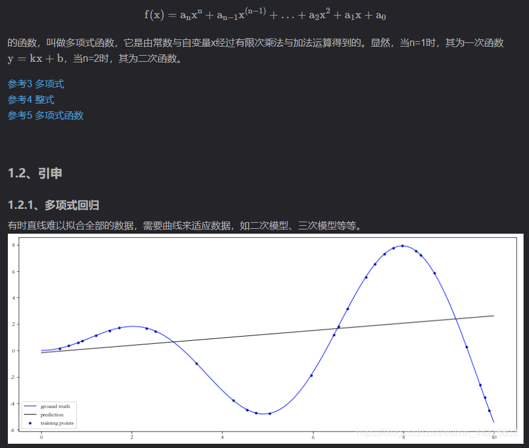

## 1、docker部署
```
    - Docker：
        (0) 创建容器： docker run -itd -p 9001:80 osint:latest /bin/bash   注意：一定要设置网络端口，否则无法通过网络访问
                      如果创建时忘记加，可如下解决https://www.cnblogs.com/chenpython123/p/10823879.html
        (1) 查看容器： docker ps -a
        (2) 启动容器:  docker start [CONTAINER ID] 即（1）中的id，例如docker start 7ecc6a84fb24
                      docker exec -it 7ecc6a84fb24 /bin/bash
        (3) 创建帐号:  useradd tmlcloud  && passwd tmlcloud  帐号密码为上述【统一帐号】
        (4) 创建新镜像：sudo docker commit -a "xly" -m "tml" 7ecc6a84fb24 customs:latest
                              （docker commit -a "[作者]" -m "[描述]" [docker_id] [新镜像名]:[新镜像版本]）
        (5) 导出：     docker save 01ce4b0b7695 > customs.tar
                              （docker save [image_id] > [customs.tar]）
        (6) 导入：     docker load -i customs.tar
        注意：1、安装docker  （注意不要安装在系统盘）
                    yum install docker
                    2、Docker 安装后 报 Cannot connect to the Docker daemon at unix:///var/run/docker.sock. Is the docker daemon running? 解决办法
                    https://www.cnblogs.com/forturn/p/9371841.html
        (7) 进入容器：sudo docker run -it [image_name] /bin/bash
        (7.1)docker容器自启动：docker container update --restart=always $(docker ps -a -q)
        关闭自启动：docker container update --restart=no $(docker ps -a -q)
      (8)可能遇到的一些问题：
           1、docker安装默认位置在系统盘，需要重新更改下位置，例：https://blog.csdn.net/runner668/article/details/80713713
           2、重新部署一台服务器的时候，会出现服务器本身访问不了docker的情况
                原因2：服务器或者docker防火墙没有开
                原因3：docker配置了nginx后，外部服务器nginx没有配置docker的ip
                解决方法：vi /etc/nginx/nginx.conf
                                    将location这一块内容替换为，其中172.17.0.2与docker一致
                                        location /gmy_analyze {
                                            proxy_pass        http://172.17.0.2/gmy_analyze;
                                            proxy_redirect off;
                                            proxy_read_timeout 200;
                                            proxy_set_header  Host  $host;
                                            proxy_set_header  X-Real-IP  $remote_addr;
                                            proxy_set_header  X-Forwarded-For  $proxy_add_x_forwarded_for;
                                            proxy_next_upstream error timeout invalid_header http_500 http_502 http_503 http_504;
                                        }
                                        重启docker和nginx
    - Lib:
        (1) Nginx: 
        
                - 下载：wget http://nginx.org/download/nginx-1.17.5.tar.gz ;  
                
                - 编译安装： ./configure ; make && make install
                - 配置： /usr/local/nginx/conf/nginx.conf 
                        location / {
                            root /var/www/nginx-tml-platform/;
                            expires 5d;
                        }
                - 启动: /usr/local/nginx/sbin/nginx
                - 创建目录: mkdir -p /var/www/nginx-tml-platform && chown tmlcloud:tmlcloud -R /var/www
        (2) Mysql
                - 启动：   service mysqld start
                - 配置：   1. mysqladmin -u root password pku123
                          2. mysql -u root -p
                              create database rzy;    
                          3. vi /etc/my.cnf  
                             [mysqld]
                             datadir=/var/lib/mysql
                             socket=/var/lib/mysql/mysql.sock
                             user=mysql
                             symbolic-links=0
                             character-set-server = utf8
                             skip-grant-tables
                             [mysql]
                             default-character-set=utf8
                             [mysqld_safe]
                             log-error=/var/log/mysqld.log
                             pid-file=/var/run/mysqld/mysqld.pid  
```     
## 2、数据库相应命令（可以mysql界面化操作）
```
1、登录查看：
mysql -h datafactory.tmlsystem.com -P 52869 -u tao -ppku123
show databases;
use tml_crawler_db;
show tables;
SELECT * FROM spider_tasks_result WHERE main_sha1 LIKE '%f0aeeed06fa464fc54d91ba5ea9fbeafd441a74a%' and (spider_name LIKE 'articles_weibo' or spider_name LIKE 'articles_tieba');
2、增删改查：
#增加一列vip，类型varchar默认为0，放在main_sha1后面：
alter table spider_tasks_queue add column vip varchar(255) DEFAULT 0 after main_sha1;
#删除一列vip
ALTER TABLE spider_tasks_queue DROP COLUMN vip;
#修改某个字段（直接执行有问题，直接界面操作）
update chatbot.events set sender_id = 'purchase_luoyan.xie' where sender_id = 'jdpurchase_luoyan.xie6';
#替换某个字段
update chatbot.company_address set company_name = replace(company_name,"索尼中国","索尼（中国）") where company_name like "%索尼中国%";
#随机查找数据
select * from botstructure.bot111_train  where Intent = 'other' order by rand() limit 5; 
3、[卸载mysql](https://blog.csdn.net/iehadoop/article/details/82961264)
4、[安装mysql](https://www.cnblogs.com/opsprobe/p/9126864.html)
#1、安装数据库：
apt install mysql-server
#查看是否安装成功：
netstat -tap | grep mysql
#进入数据库(默认没有密码)：
mysql -u root -p
#修改密码：
use mysql;
UPDATE user SET password = PASSWORD('新密码') WHERE user = 'root'; 
或者
SET PASSWORD FOR 'root'@'%' = PASSWORD('新密码');
或者
update mysql.user set authentication_string=password('新密码') where user='root';
FLUSH PRIVILEGES;
#数据库修改远程访问权限：
use mysql;
update user set host = '%' where user = 'root';
#查询mysql中所有用户权限：
select host, user from user;
FLUSH PRIVILEGES;
#mysql配置文件注释：
vi /etc/mysql/mysql.conf.d/mysqld.cnf
#注释这一行：
bind-address=127.0.0.1
#mysql重启：
service mysqld restart
#2、安装数据库客户端
apt-get install mysql-workbench
5、安装workbench 
sudo apt-get install mysql-workbench
6、数据库中文编码问题Er1366，解决方法：
某个字段名，例如city，进入编辑页面，collation改为utf8_general_ci
7、id重新排序：
alter table chatbot.jd_express drop column id;
alter table chatbot.jd_express add id mediumint(8) not null primary key auto_increment first;
8、统计数据：
select question as ask, count(question) as count from chatbot.question_record group by question order by count(question) desc limit 10;
注意：
1、输出的数据将question重新命名为ask
2、count统计question的个数
3、group by question根据question分组（与count对应）
4、order by count(question)根据question的个数分类
5、desc降序（asc升序）
9、[跨表查询](https://blog.csdn.net/qq_45973003/article/details/122869770)
#查询q表和e表，当e.intent等于q.intent且q.intent_type等于“ecar”时，输出q.question和e的所有值
SELECT q.question,e.* FROM chatbot.question_example_standard q,chatbot.ecar e where e.intent=q.intent and q.intent_type="ecar";
10、正则:查询name中(不)符合正则'feedback_[0-9]'的数据
select * from table where name REGEXP 'feedback_[0-9]'
select * from table where name not REGEXP 'feedback_[0-9]'
11、字符串拼接：
CONCAT ('\n' ,title, '\n')
```
### 2.1、数据库相应命令（可以mongodb界面化操作）
```
1、安装：（server与client版本一致）
[方法1](https://blog.csdn.net/crsitin_spade/article/details/121383699)
[方法2](https://blog.csdn.net/li1325169021/article/details/124236076)
[方法3](https://blog.csdn.net/qq_18404993/article/details/121103912)
2、[相关命令](https://blog.csdn.net/lejian/article/details/123364069)
3、注意点:
插入一条：insert_one({})
插入多条：insert_many([{},{}])
替换插入：
#若满足id的数据，更新这条数据为data_json，否则插入新的数据data_json
mongo_collection.replace_one({'id':data_json['id']},data_json,upsert=True)
#查询：select id from table where name = 'weibo'
find({'name':'weibo'},{'id':1})
```
## 3、SVN操作
```
#SVN与git类似
sudo apt-get install subversion
svn co svn://10.0.0.3:9091/customers/dev_deployment/ --username tml--password mt12sadkjh!@
svn add
svn commint　-m
svn up
svnstatus 
```
## 4、前后端调试步骤
```
【h5】
1、前期准备：
1.1、将前端代码git到本地：git clone
1.2、ubuntu配置nodejs+npm+vue环境：https://www.cnblogs.com/HansBug/p/8901865.html
2、切换到h5目录下面
3、到配置目录切换测试环境：
执行命令：
cd cd config/
ln -s index.js.product index.js
注意：index.js不用提交
4、本地安装依赖：
执行命令：
npm install
5、启动项目：
执行命令：
npm run dev
6、打开网址查看前端效果：http://localhost:8081
7、提交代码
【后端接口对接】
测试环境：
ssh web@10.0.0.2
cd develop/yulongxue/tml-osint-factory/
例：前端雷达图对接
修改search_view.py中的category_of_radial_chart函数和urls.py中的url('category_of_radial_chart/', category_of_radial_chart),  # 网状图
调试：
注意：前端是 http://47.93.121.36/apps/category_of_radial_chart/   后端nginx配置的是http://10.0.0.2：9095/apps/category_of_radial_chart/
  1、在search_view.py中设置断点
  2、启动调试环境：python manage.py runserver 0.0.0.0:9095
  3、本地post请求：（post：新增，put：更新，get：查询，delete：删除）
        import requests
        data = {'time_delta': 10, 'report_sha1': 'e3d130b5d35154503db5cbfb5df184b3ab022700'}
        url = 'http://10.0.0.2:9095/apps/category_of_radial_chart/'
        r = requests.post(url,data)
        #r.text
  4、在服务器端可以断点测试
注意：get和post的区别在于：
1、get直接把参数包含在URL中，post通过request body传递参数；
2、get把http header和data一起同时发送，服务器响应200（返回数据），即产生一个TCP数据包；post浏览器先发送header，服务器响应100continue，浏览器在发送data，服务器响应200（返回数据），即产生两个TCP数据包。
```
## 5、前端的一些知识
```
1、html网页大概框架；vue网页详细呈现内容（长什么样）；js在vue中的点击事件所用到的详细方法；css样式的定义
2、vue框架eliment-ui,js弹出层组件layer
3、弹出层组件layer(样式适应性极高)替代传统的alert(样式旧，字体无法加颜色)
4、jQery方法：
方法一：点击事件后若请求失败先弹出提示信息再弹出对话框
$(document).ready(function() {
  $('#myCustomTrigger').click(function (event) {
jQuery.ajax({
  url: "<url>",   
  type: "get",
  cache: true,
  dataType: "script",
  error: function(XMLHttpRequest, textStatus, errorThrown) {
        //需要下载该组件
        layer.open({
          title: '提示',
          content: '<span>首次登陆烦请您先进行反馈表安全验证。具体方法为点击“确认”按钮，访问“https://43.82.117.204/”，</span><span style="color:#ff0000;">点击“高级”，点击“继续前往”</span><span>。之后请您</span><span style="color:#ff0000;">刷新本页面</span><span>，点击工单申请按钮，提供您的申请。谢谢！</span>',
          btn: ['确认', '取消'],
                  yes: function(index, layero) {
                      window.open('https://43.82.117.204/')
                      parent.layer.close(index);//关闭弹出层
                      // window.parent.location.reload();//刷新父页面
                  },
        });
    }
});
window.ATL_JQ_PAGE_PROPS =  {
  "triggerFunction": function(showCollectorDialog) {  
      showCollectorDialog();
  }};
 });
});
```
```
XXXXXX方法二：页面加载时若请求失败先弹出提示信息，点击事件后再弹出对话框
jQuery.ajax({
  url: "<url>",  
  type: "get",
  cache: true,
  dataType: "script",
        error: function(XMLHttpRequest, textStatus, errorThrown) {
              //需要下载该组件
              layer.open({
                title: '提示',
                content: '<span>首次登陆烦请您先进行反馈表安全验证。具体方法为点击“确认”按钮，访问“https://43.82.117.204/”，</span><span style="color:#ff0000;">点击“高级”，点击“继续前往”</span><span>。之后请您</span><span style="color:#ff0000;">刷新本页面</span><span>，点击工单申请按钮，提供您的申请。谢谢！</span>',
                btn: ['确认', '取消'],
                        yes: function(index, layero) {
                            window.open('https://43.82.117.204/')
                            parent.layer.close(index);//关闭弹出层
                            // window.parent.location.reload();//刷新父页面
                        },
              });
          }
});

window.ATL_JQ_PAGE_PROPS =  {
  "triggerFunction": function(showCollectorDialog) {  
    jQuery("#myCustomTrigger").click(function(e) {
    e.preventDefault();
      showCollectorDialog();
    });
  }}
5、mounted()：刷新页面执行的操作
6、localStorage：长久保存整个网站的数据,保存的数据没有过期时间,直到手动去删除
插入字段：localStorage.setItem('username',processName);
获取字段：localStorage.getItem("username");
删除字段：localStorage.removeItem('username');
7、VueI18n：中英文切换
8、el-table
（1）表头固定：设置max-height
（2）调整表头高度
  .el-table__header tr,
  .el-table__header th {
    padding: 0;
    height: 42px;
    font-size: 14px;
  }
（3）调整表格高度
  .el-table__body tr,
  .el-table__body td {
    padding: 0;
    height: 80px;
    font-size: 14px;
  }
8.1、el-table-column
单元格字数过长时省略：show-overflow-tooltip
9、vue中处理数据，可以在method中写处理函数，return处理后的值，vue直接调该函数
<div v-for="item in splitFunction(scope.row.image)">
<a :href="imageURL+item" target="_blank" style="color: #409eff">{{item}}</a>
splitFunction(data){
  if (data != undefined){
    var imageList = data.split(",")
  }
  return imageList
}
10、静态文件超链接(a标签)，实现点击静态文件，浏览器可以进行查看，该静态文件可以放在static目录下，也可以放在对应服务器其他目录，但需要配置nginx，例如：url=http://192.168.11.103/botimg/trip05.png
11、前端上传文件给后端：el-upload
12、前端下载文件：后端返回文件的url（nginx配置），前端打开location.href=(url);
13、布局el-row行(设置每列之间的距离)：
<el-row :gutter="24">
el-col列(设置几行)：
<el-col :span="10">
14、可以直接在js中构建html代码字符串，实现展示；或者，先vue实现展示，js中加判断条件，当条件满足时，vue实现展示
15、若需要将文件(上传时需为二进制)和json值都作为参数传给接口，可以定义new FormData()
16、若报warning，该函数没有这个方法，可以打印该函数检查，可能该函数是列表，需要[i]才能取值
17、element-ui中英文切换
#main.js
import Element from 'element-ui'
import ElementLocale from 'element-ui/lib/locale'
import 'element-ui/lib/theme-chalk/index.css'
import i18n from './lang'
Vue.use(Element)
// element-ui组件中英文切换的关键
ElementLocale.i18n((key, value) => i18n.t(key, value))
/* eslint-disable no-new */
new Vue({
  el: '#app',
  router,
  i18n,
  components: { App },
  template: '<App/>'
})
#lang/index.js
import zh from './zh.js';
import en from './en.js';
import Vue from 'vue'
import VueI18n from 'vue-i18n'
import enLocale from 'element-ui/lib/locale/lang/en'
import zhLocale from 'element-ui/lib/locale/lang/zh-CN'
Vue.use(VueI18n);
const messages = {
  'zh':{
    ...zh,
    ...zhLocale
  },
  'en':{
    ...en,
    ...enLocale
  }
}
const i18n = new VueI18n({
  // 不设置默认语言，语言状态由历史记录决定(主页面每次切换语言的时候，需要将语言状态存到localStorage中)
  locale: localStorage.getItem('lang')||'zh',
  messages
})
export default i18n;
#lang/en.js
import {XX} from "../utils/url.js";
export default {
  sendNullMessage: "Can't send empty content"
}
#lang/en.js
import {XX} from "../utils/url.js"
export default {
  sendNullMessage: "不能发送空的内容"
}
#实际使用
#定义
sendNullMessage: this.$t("sendNullMessage")
#vue方法中
$t("sendNullMessage")
#js方法中
this.$t("sendNullMessage")
18、修改组件默认style——!important
.el-form-item__label {
  font-size: 12px !important;
}
19、前端调样式的时候，若出现怎么调也没用的情况，可能是项目默认css文件中配置了
20、单独html实现button，调用api功能，可以使用$.ajax
21、前端项目文件：router-路由配置文件夹（ip/detail;ip/detail1）跳转
  （1）路由直接带参数：
                      {
                      path: '/detail/:id/:info/:isTrue/:classList',
                      name: 'detail',
                      component: Detail
                      }
                调用:this.$route.params
  （2）vue-router中hash模式和history模式：
      2.1：默认hash模式:可以通过window.location.href获取参数
        优点：可以访问任意url，没有先后
        缺点：url中带'#'，不美观
      2.2：histoty模式：可以通过this.$route.params获取参数
        优点：不带'#'
        缺点：需要配置nginx，
            location / {
                 try_files $uri $uri/ /index.html;
                 }
            根路径前进后退都可以，但只有访问过根路径，才能访问其他路径，例如:"/"-->"/chatbot"
22、请求api方法：axios（异步）---多个方法没有先后顺序
23、css方法:
    （1）弹性布局：页面样式不会随页面放大缩小变化
         display:flex
    （2）尽量不要修改固定框架的样式，例如：el-row..，可以在该方法里面加上class="style-row",添加样式
    （3）id是唯一的（#{}），class（.{}）可以用于不同的id(不同的人id可以穿一样的衣服class)
    （4）链接属性：
          a:link {color:#000000;}      /* 未访问链接*/
          a:visited {color:#00FF00;}  /* 已访问链接 */
          a:hover {color:#FF00FF;}  /* 鼠标移动到链接上 */
          a:active {color:#0000FF;}  /* 鼠标点击时 */
    （5）当需要修改一些默认css样式时，为防止多个地方混用，嵌套css，例如：
         .cai_suggest .el-form-item__label {
                  XXXXX
          }
24、双目运算：
c[a==b?1:0]=d，若a等于b，则c[1]=d，否则c[0]=d
25、html的一些知识：
   25.1、结构:
  <!DOCTYPE HTML> <!-- HTML5标准网页声明 -->
  <HTML> <!-- HTML为根标签，代表整个网页 -->

  <head> <!-- head为头部标签，一般用来描述文档的各种属性和信息， 包括标题等-->
    <meta charset="UTF-8"> <!-- 设置字符集为utf-8 -->
    <title>my HTML</title> <!-- 设置浏览器的标题 -->
    <link rel="stylesheet" href="/css/main.css" /> <!-- 设置css -->
    <script type="text/javascript" src="/js/jquery-3.5.1.js"></script> <!-- 设置js -->
  </head>

  <!-- 网页所有的内容都写在body标签内 -->
  <body> 
  <script type="text/javascript">
  // 获取html url,html可以通过"index.html?mail=luo@sony.com&tel=18262602093"的形式传参
  var searchURL = decodeURI(window.location.search.substring(1));
  // 页面加载完成后执行，构建form预填充值
  $(document).ready(function() {
            $("#mail").val(paramsIsNull(params[0].split("=")));
            $("#tel").val(paramsIsNull(params[1].split("=")));
            });
  // 一些js方法
  function paramsIsNull(data){
      if(data.length>=2){
        return data[1]
      }else{
        return ''
      }
        } 
  // 表单验证方法
  function checkTel(){
      var tel = document.getElementById("tel").value;
      const MobileReg = /^1[3|4|5|7|8][0-9]{9}$/;
      const PhoneReg = /^([0-9]{3,4}-)?[0-9]{7,8}$/;
      var flag = MobileReg.test(tel)||PhoneReg.test(tel);
      var s_tel = document.getElementById("s_tel");
      if(!flag){
          s_tel.innerHTML = "电话格式有误";
      }
      return flag;  
  }
  function checkMail(){
      var mail = document.getElementById("mail").value;
      var reg_mail = /^([a-zA-Z0-9._-])+@(pt.)*(sony.com)+/;
      var flag = reg_mail.test(mail);
      var s_mail = document.getElementById("s_mail");
      if(!flag){
          s_mail.innerHTML = "邮箱格式有误";
      }
      return flag;
  }
  // 表单提交
  function check(form)  {
      if(checkTel() && checkMail ()){
      var customerInfo = new FormData();
      // debugger
      var formLabelAlign = {
          tel: form.tel.value,
          mail: form.mail.value,  
      }
      customerInfo.append("formDatas",JSON.stringify(formLabelAlign))
      var files = document.forms["customerForm"]["files"].files
      for (var i = 0; i<files.length;i++) {
          customerInfo.append('files',files[i]);
      }
      customerInfo.append('ip',"https://52e2-38-83-110-6.ngrok.io/");
      $.ajax({
          url: "https://52e2-38-83-110-6.ngrok.io/" + "python/createJira",
          type: 'post',
          contentType: false,
          // 告诉jQuery不要去设置Content-Type请求头
          processData: false,
          // 告诉jQuery不要去处理发送的数据
          data: customerInfo,
          success: function (data){
              console.log("success")
              data.tel = formLabelAlign.tel
              data.citys = formLabelAlign.citys
              data.mail = formLabelAlign.mail
              microsoftTeams.tasks.submitTask(data,"69fd48bf-078f-4eca-a79a-ee62c106584a");
              microsoftTeams.tasks.submitTask(null)
              return true;
          },
          error: function (error){
              console.log("error")
              data.tel = formLabelAlign.tel
              data.citys = formLabelAlign.citys
              data.mail = formLabelAlign.mail
              data.info = "error"
              microsoftTeams.tasks.submitTask(data,"69fd48bf-078f-4eca-a79a-ee62c106584a");
              return true;
          }
      })
      }
      }
  </script>
    <div class="surface theme-light">
        <div class="panel">
            <div class="font-semibold font-title">请确认您此次申请服务的信息:</div>
            <form method="get" id="customerForm" onSubmit="return validateForm()">
                <div>
                    <label for="tel"><span style="color:red">* </span>联系电话(Telephone): </label><input class="form-control input-field" id="tel" type="tel" name="tel" tabindex="3">
                    <span id="s_tel" style="color:red"></span>

                    <div class="form-group form-field-input" style="margin-bottom: 10px;"></div>
                    <label for="mail"><span style="color:red">* </span>邮箱地址(Email): </label><input class="form-control input-field" id="mail" type="email" placeholder="name@sony.com" name="mail" style="margin-bottom: 10px;" tabindex="5">
                    <span id="s_mail" style="color:red"></span>

                    <div class="form-group form-field-input" style="margin-bottom: 10px;"></div>
                    <label for="files">添加附件: </label><input class="form-control input-field" style="height:37px" id="files" type="file" multiple name="files" style="margin-bottom: 10px;" tabindex="6" >

                    <button style="margin-top: 10px;" class="btn button-primary" type="button" tabindex="5" onclick=check(form)>提交</button>
                </div>
            </form>
        </div>
    </div>
  </body>

  </HTML>
   25.2、type="text/javascript" 与type="module"的区别：
   1、type="text/javascript" 是普通的JavaScript，它是一种常见的脚本语言，用于网页的客户端脚本编程。
   2、type="module" 是一种新的 JavaScript 模块规范，它支持模块的导入和导出，实现代码的异步加载。
   25.3、html传参方法：
a、url传参：index.html?mail=luo@sony.com?tel=18262602093
b、引入js、参数、css：<script></script>
   25.4、表单提交： input框 type=“submit“ 和“button“有什么区别
   1、<input type="button /> 需添加onclick=check(form)，点击执行check方法-->ajax方法。
   2、<input type="submit /> 无onclick，点击后会执行提交form表单的动作onsubmit="alert('Hello')"。
26、vue结构：
<template>
</template>
 
<script>
import .. from "..";
export default {
  name: 'hello',
  components: {..,..},
  props: {}, //接收父组件传递过来的参数
  created : {}, //html加载完成之前
  computed: {}, //提供简单的数据计算
  watch: {}, //监听vue实例上数据的变动
  //定义及初始化数据
  data () {
    return {
      msg: '欢迎来到菜鸟教程！'
    }
  }
  methods: {}, //提供复杂的数据计算
  mounted: {}, //html加载完成后执行
}
</script>
<style>
</style>
27、vue父组件与子组件的调用
##子组件
<template>
  <div class="train-city">
    <h3>message:sendData</h3> 
    <br/><button @click='select(`大连`)'>点击此处将‘大连’发射给父组件</button>
  </div>
</template>
 
<script>
export default {
  //组件名字
  name: "train-city",
  //需要父组件传递的参数
  props:{
    sendData:{
      Type:String,
      default:""
    }
  },
  //子组件自己的参数
  data(){
    return{
        message: '父组件传给子组件的toCity'
    }
},
methods:{
    select(value){
       //select事件触发后，自动触发showCityName事件，将子组件参数value传递给父组件
       this.$emit('showCityName',value)
    } 
    },
}
</script>
##父组件
<template>
    <div>
        //将sendData传给子组件train-city
        <train-city @showCityName="updateCity" :sendData="toCity"></train-city>
    </div>
<template>
<script>
import train-city from "./train-city";
export default {
  name: "parent-com",
  components: { train-city },
  methods:{
      updateCity(value){
         console.log(value)
      } 
      },
}
</script>
```
## 6、linux的一些命令
```
（1）#!/bin/sh
ps -ef|grep python|grep -v grep|awk '{print "kill -9 "$2}'|sh
（2）sudo加上密码
echo %s|sudo -S %s' % (password,command)
（3）杀掉占用指定端口服务:sudo kill -9 $(lsof -t -i:5003)
（4）查询历史记录:history|grep super 
（5）查看内存:top 
（6）查看文件位置:locate _tml_getinfo 
（7）文件名:find -iname 
（8）查看有多少文件：ls -l
（9）列出文件夹中*2019_11_14*文件的个数：ls -l *2019_11_14*|grep "_"|wc -l
（10）删除a.txt文件中的1-100行：sed -i '1,100d' a.txt
（11）查找出现指定内容的文件：grep -nIr "127.0.0.1"
（12）查看端口占用：sudo netstat -anp |grep 80
```
## 7、爬虫知识
```
1.摘要值：（类似于文件的标签，来确定文件在传输过程中是否是完整的）
保证数据的完整性：例如你发送一个100M的文件给你的B，但是你不知道B收到的是否是完整的文件；此时你首先使用摘要算法，如MD5，计算了一个固定长度的摘要，将这个摘要和文件一起发送给B，B接收完文件之后，同样使用MD5计算摘要，如果B计算的结果和你发送给他的摘要结果一致，说明B接收的文件是完整的。
2.MD5(加密)：MD5算法就像一个函数，任意一个二进制串都可以作为自变量进入这个“函数”，然后会出来一个固定为128位的二进制串。
3.Hash函数是一个将任意长度的消息(message)映射成固定长度消息的函数 简称h（X）对于任何消息x ,将h(x)称为x的Hash值、散列值、消息摘要值。
注：MD5是Hash函数的一种
4、反扒机制处理：
headers = {
##浏览器代理
'user-agent': "Mozilla/5.0 (Windows NT 10.0; Win64; x64) AppleWebKit/537.36 (KHTML, like Gecko) Chrome/104.0.5112.102 Safari/537.36 Edg/104.0.1293.63", 
##页面跳转处
'referer': "https://www.baidu.com/", 
##登录信息
'cookie':cookies
}
response = requests.get("https://www.douyin.com/video/{}".format(1111),headers,timeout=30)
1、添加headers
2、尽可能的修改headers中的参数(例如：抖音-signature加密)
3、为了防止请求卡住不动，添加timeout
```
## 8、pip镜像/源下载
```
1、sudo pip install solrpy -i http://pypi.douban.com/simple --trusted-host pypi.douban.com
yum（适用于centos）
2、pip安装方法
全自动安装： easy_install jieba 或者 pip install jieba / pip3 install jieba
半自动安装：先下载 https://pypi.python.org/pypi/jieba/ ，解压后运行 python setup.py install
手动安装：将 jieba 目录放置于当前目录或者 site-packages 目录
通过 import jieba 来引用
```
## 9、虚拟环境安装
```
1、[virtualenv](https://www.cnblogs.com/freely/p/8022923.html)
（python2.6安装存在问题，可以重装python2.7）
2、conda:额外安装其他包
```
## 10、python知识
```
1、编码问题
      /xe转成中文
      例：li = [((33, 39), '宝马'), ((36, 39), '马')]
              print str(li).decode("string_escape")
      输出就是可查看的样式 [((33, 39), '宝马'), ((36, 39), '马')]
2、全角问题
      import re,pdb
      #解决字符串不能编译成unicode的问题
      import sys
      reload(sys)
      sys.setdefaultencoding('utf8')
      s = '无限极（中国）有限公司'
      ss = re.sub(u'[（]', '(', s.decode())
      aa = re.sub(u'[）]', ')', ss.decode())
      print aa
3、break与continue问题（必须配合if语句使用）
      break:循环中，若判断满足条件，执行break后所有循环都停止(结束所有循环)
      continue:循环中，若判断满足条件，执行continue后，以下代码不执行，继续下次循环(提前结束本轮循环，并直接开始下一轮循环)
4、类的例子:https://baijiahao.baidu.com/s?id=1705874913379869451&wfr=spider&for=pc
      （1）简单的例子
      class Student(object):
        def __init__(self,name,score):
          self.name = name
          self.score = score
        def get_score(self):
          if self.score < 60:
            return '该生不及格'
          elif 60 <= self.score <= 100:
            return '该生及格了'

      lisa = Student('Lisa',90)
      print(lisa.name,lisa.get_score())
      （2）访问限制
      上面的例子中，虽然内部定义了name和score，但是外部还是可以修改，例：
      >>> bart = Student('Bart Simpson', 59)
      >>> bart.score
      59
      >>> bart.score = 99
      >>> bart.score
      99
      若改成self.__name = name、self.__score = score，就变成了私有变量，只有内部可以访问，外部不能访问
      （3）继承和多态
      I、继承
      上面例子中object表示所有类，当然我们可以定义基类/父类，让子类继承，例：
      ##父类
      class Animal(object):
          def run(self):
              print('Animal is running...')
      ##继承的子类
      class Dog(Animal):
          pass  
      >>>>Animal is running...
      II、多态
      当父类和子类存在相同的方法时，父类的方法会被覆盖
      ##继承的子类
      class Dog(Animal):
          def run(self):
              print('Dog is running...') 
      >>>>Dog is running...  
      III、实例属性和类属性
      ##实例属性
      class Student(object):
        def __init__(self,name,score):
          self.name = name
          self.score = score
      ##类属性(归student所有)
      class Student(object):
        name = 'student'
      （4）使用__slots__限制实例的属性
      class Student(object):
          __slots__ = ('name', 'age') # 用tuple定义允许绑定的属性名称
      （5）@property，对类中的参数进行必要的检查，例：
      class Student(object):
          #将score方法转换成score属性，可属性直接调用a=Student.score而不是b=Student.score()
          @property
          def score(self):
              return self._score
          #直接给属性赋值，Student.score='hh'而不是Student.score=('hh')
          @score.setter
          def score(self, value):
              if not isinstance(value, int):
                  raise ValueError('score must be an integer!')
              if value < 0 or value > 100:
                  raise ValueError('score must between 0 ~ 100!')
              self._score = value
      >>> s = Student()
      >>> s.score = 60 # OK，实际转化为s.set_score(60)
      >>> s.score # OK，实际转化为s.get_score()
      60
      >>> s.score = 9999
      Traceback (most recent call last):
        ...
      ValueError: score must between 0 ~ 100!
      即表示只允许对Student实例添加name和age属性
      (4) 子类继承父类的实例属性：
      class Animal(object):  #  python3中所有类都可以继承于object基类
         def __init__(self, name, age):
             self.name = name
             self.age = age

         def call(self):
             print(self.name, '会叫')

      # 现在我们需要定义一个Cat 猫类继承于Animal，猫类比动物类多一个sex属性。 
      class Cat(Animal):
         def __init__(self,name,age,sex):
             super(Cat, self).__init__(name,age)  # 不要忘记从Animal类引入属性，否则无法继承父类的name、age
             self.sex=sex

      if __name__ == '__main__':  # 单模块被引用时下面代码不会受影响，用于调试
         c = Cat('喵喵', 2, '男')  #  Cat继承了父类Animal的属性
         c.call()  # 输出 喵喵 会叫 ，Cat继承了父类Animal的方法 

5、生成器
      列表生成式：a = [i for i in [1,2,3] if i > 3]
      占用空间大，取数据：a[1]....
      生成器：a = (i for i in [1,2,3] if i > 3)
      列表元素是按某种算法推算出来的，占用空间小，取数据：for
6、map函数（节省计算步骤）
      例：
      def f(x):
        return x*x
      r = map(f,[1,3,2,5])
      list[r]
      >>>>>[1,9,4,25]
7、匿名函数（lambda）：即不用另外定义一个函数来计算
      lambda n:n%2==1 等同于def test(n): return n%2==1
      L = list(filter(lambda n:n%2==1, range(1, 20)))(filter过滤range中满足lambda的值)
      >>>>>[1, 3, 5, 7, 9, 11, 13, 15, 17, 19]
8、装饰器：（@）在不修改原有函数的技术，在代码运行期间动态增加功能的方式
      def log(func):
          def wrapper(*args, **kw):
              print('call %s():' % func.__name__)
              return func(*args, **kw)
          return wrapper
      @log
      def now():
          print('2015-3-25')
      now()
      >>>>>call now():
      >>>>>2015-3-25
      其中*args表示非关键字参数（以元祖形式呈现），**kw表示关键字参数（以字典形式呈现）
9、偏函数
      （1）转换为数字：int('123') ----->>>123
      （2）转换成二进制(base)：int('123',base=8)----->>>83
      （3）int2 = functools.partial(int, base=2)  int2('1000000')----->>>64
10、作用域
        类似__xxx__这样的变量是特殊变量，可以被直接引用，但是有特殊用途
        类似_xxx和__xxx这样的函数或变量就是非公开的（private），不应该被直接引用
11、排序/翻转
        (1)、list.sort(reverse=True)
        对原来的列表进行的操作，不会产生一个新列表
        (2)、sorted(list,reverse=True)
        在原来列表的基础上，产生一个有序的新列表，可以复制一个列表名(对可迭代序列有效，例如a-z)
        (3)、list.reverse()----->list
        (4)、a=reversed(list)---->a为迭代器，list(a)
12、yield(相当于return,只有遇到next才会执行)
        import pdb
        def foo():
            print("starting...")
            while True:
                res = yield 4
                print("res:",res)
        # 直接调用含yield的函数，即foo不会真正执行，只是先得到一个生成器g(相当于一个对象)
        g = foo()
        >>>生成器
        # 当调用next函数时，返回yield的值，类似于return，即return后面的内容不执行(即也没有进行赋值)
        print(next(g))
        >>>starting...
        >>>4
        print("*"*20)
        # 当再次调用next函数时，会从上次停止的地方执行，因为上次没有赋值，所以res为None，执行循环，执行yield，输出4
        print(next(g))
        >>>res:None
        >>>4
13、静态方法：@staticmethod或@classmethod
      （1）相同：可以不需要实例化，直接类名.方法名()来调用；
      （2）不同：
            class A(object):  
                bar = 1  
                def foo(self):  
                    print 'foo'  

                @staticmethod  
                def static_foo():  
                    print 'static_foo'  
                    print A.bar  

                @classmethod  
                def class_foo(cls):  
                    print 'class_foo'  
                    print cls.bar  
                    cls().foo()  
            ###执行  
            A.static_foo()  
            A.class_foo()  
            >>>输出：
                static_foo
                1
                class_foo
                1
                foo
14、jira用法
        1、登录：（最好配置api token作为登录密码）
        # 通过jira域名和账户密码登录（'verify': False 解决jira报certificate verify failed的问题）
        jira = JIRA(SETTINGS.BASE_URL, basic_auth=(SETTINGS.USERNAME, SETTINGS.PASSWORD),options={'verify': False})
        2、获取每个项目的所有jira
        all_bug=jira.search_issues("project = 'WSD Worksheet System'",maxResults=-1)#jql语法，查询项目为JD下面的所有缺陷，最多2000条
        3、获取单个jira的issue
        issue = jira.issue(jira_id)
        3.1、获取单个jira中所有issue的字段组成
        res = issue.raw
        4、新建jira
        create_jira = jira.create_issue(issue_dict)
        5、updatejira(增改删[{"add/set/remove":{"name":components_value}}])
        issue.update(components=[{"add":{"name":components_value}}])
        6、上传附件
        jira.add_attachment(issue=issue, attachment=attachmentFileName)
15、python收发邮件（smtplib/poplib）
        1、确保该邮箱的smtp/pop邮件服务器及port是多少，支持收发邮件
            telnet smtp.office365.com 587/telnet outlook.office365.com 110
            可以输出正确的登录提示
        2、配置邮箱的smtp/pop授权码
        3、发送html邮件，html格式/button应邮件服务器而显示不同，建议用打开外部链接的方式实现button功能
16、列表与链表
（1）区别：物理储存单元的储存结构分为连续型和链型，连续性即列表，列表是先开辟一个固定大小的空间，之后往里面按照顺序填充数据，该空间大小之后就不能改变了；链表存储的是（数据，指针）这样的单元，存储位置是不按照顺序，不连续的，所以可能会产生碎片式空间，空间利用率较低，但是空间大小不是固定的。
（2）链表的操作：https://blog.csdn.net/qq_30815237/article/details/90750349
      class Node:
          def __init__(self,data = None, next = None):
              self.data = data
              self.next = next
      #定义节点
      node1 = Node(1)
      node2 = Node(2)
      node3 = Node(3)
      #定义节点间的关系
      node1.next = node2
      node2.next = node3
17、数据结构
（1）数据结构含义：数据顺序和位置关系的便是“数据结构。
（2）链表：存储数据和指针，访问耗时，增加/删除简便。
（3）数组：按index存储数据，访问简便，增加/删除耗时。
（4）栈：入栈push、出栈pop，后进先出
（5）队列：入队、出队，先进先出
（6）哈希表：{key:value},访问迅速
（7）堆：一种图的数据结构，堆中最顶端的数据始终最小
（8）二叉查找树：节点从左往下，越来越小；从右往下，越来越大
18、排序
（1）冒泡简单排序(O(n))：重复从序列右边开始比较两个数字的大小，根据结果交换两个数字的位置，数字类似于泡泡从右往左浮动。
（2）选择排序(O(n**2))：重复从序列中寻找最小值，将其与序列最左边的数字进行交换。
（3）插入排序：从序列左端开始依次对数据进行排序，先固定左侧一位数字，将右侧最近的数字与左侧数据进行排序插入，直到数据全部排序。
（4）堆排序：运行时间短，数据结构较复杂
（5）归并排序(O(nlogn))：将序列分成长度相同的两个子序列（直到只有一个数据），就对子序列进行归并，把两个排好序的子序列合并成一个有序序列。对有序序列，只需要比较首位数据。
（6）快速排序(O(nlogn))：在序列中随机选择一个基准值(pivot)，然后将除了基准值以外的数分为“<基准值的数”，“>基准值的数”，不断重复。
     基线条件：函数不再调用自己的条件
     递归条件：函数调用自己
     含义：例如对数组内的元素进行从小到大排列，首先考虑最基础的问题，当数组长度为1的时候，返回数组本身，递归思想：(任意选择)数组内一个元素作为基准pivot，遍历数组，构建小于pivot的数组A，以及大于pivot的数组B，即排序A,pivot,B
     import random
     def quicksort(list):
         # 基线条件
         if len(list)<2:
             return list
         # 递归条件
         else:
             pivot = list[0]
             less = [i for i in list[1:] if i<=pivot]
             greater = [i for i in list[1:] if i>pivot]
             return quicksort(less)+[pivot]+quicksort(greater)
             
             
19、数组的查找
（1）线性查找：在数组中从头开始往下查找。
（2）二分查找(O(logn))：查找已经排好序的数据，通过比较数组中间的数据与目标数据的大小。
20、图的搜索
（1）广度优先搜索（宽）：从起点开始，由近及远，由左及右搜索（优先上再左右）。--队--先进先出
（2）深度优先搜索（高）：从起点开始，由左及右，由近及远（优先左再上下）--栈--后进先出
21、数据安全方法
 21.1 安全和算法
  （1）窃听：加密
  （2）假冒：消息认证码、数字签名
  （3）篡改：消息认证码、数字签名
  （4）事后否认：数字签名
 21.2 哈希函数（十六进制）SHA-2
  （1）输出的哈希值长度不变
  （2）若输入的数据相同，那么输出的哈希值也相同
  （3）输入相似的数据不会导致输出的哈希值相似
  （4）即使输入的数据完全不同，输出的哈希值也可能相同 
  （5）不能从哈希值反向推算出原本的数据
 21.3 共享密钥加密
     含义：加密和解密都使用相同密钥
 21.4 公开密钥加密
   含义：接收方提供公开密钥给发送方，发送方利用公开密钥对数据进行加密，发送给接收方，接收方用私有密钥解密数据
   缺点：出现“中间人攻击”，将公开密钥替换成其他的发给发送方，即发送方无法判断公开密钥是否来自接收方--数字证书。
 21.5 混合密钥
     含义：发送方A将共享密钥发给接收方B，B对其进行公开密钥加密，并将公开密钥发给A，A用公开密钥加密，再将加密后的密钥发给B，B进行私有密钥解密。
 21.6 迪菲-赫尔曼密钥交换
     含义：在通信双方之间安全交换密钥的方法。
 21.7 消息认证码
     含义：A生成密钥发送给B，A使用密文和密钥生成值（消息认证码）MAC，将其发给B，B也同样生成MAC，经过对比与B的MAC一致，那么B再解密
 21.8 数字签名
     含义：A准备发送消息、私有密钥、公开密钥，A将公开密钥发给B，A用私有秘钥加密信息（数字签名），A将信息和签名发给B，B使用公开密钥对密文（签名）进行解密，B对解密后消息与收到的消息对比，确认是否一致。
 21.9 数字证书
     含义：A将公开密钥PA和包含邮箱信息的个人资料发送给认证中心C，C确认信息资料，用自己的私有密钥SC和A的资料生成数字签名；C将数字签名和资料放在一个文件中，并将这个文件发给A，这个文件就是A的数字证书；A将作为公开密钥的数字证书发给B，B确认证书中的邮件是否是A的地址，确认证书是C发行的，最后取出公开密钥PA。
22、算法
 22.1 k-means算法
     含义：根据事先给出的簇的数量n进行聚类，任意选择n个中心点，计算到该中心点的距离，从而分成n类，调整中心点，继续聚类
 22.2 欧几里得算法-辗转相除法
     含义：除数/被除数=商..余数
          被除数/商=商20..余数1
          商/商1=商2..余数2
          ...
          不断重复以上操作，当商2为0时，商1就是除数和被除数的最大公约数
 22.3 素数测试-只能被1和自身整除
     方法：费马定理，如果p是素数，当n<p时，n**p%p = n,反之不成立(充分不必要)
 22.4 递归：调用自己的函数
     基线条件：函数不再调用自己的条件
     递归条件：函数调用自己
     含义：例如需要比较数组中元素最大的值，首先考虑最基础的问题，两个数比较，谁大返回谁（基线条件），递归思想：将第一个数与其余数作比较
     def max_fun(list):
         # 基线条件
         if len(list)==2:
             return list[0] if list[0]>list[1] else list[1]
         # 递归条件
         sub_max = list[0]
         return sub_max if sub_max>list[1:] else list[1:]
23、打包依赖
  （1）、确保该服务器上该项目能完全跑成功
  （2）、将依赖名写到文件中：pip freeze > requirements.txt
  （3）、导出包到require文件夹：pip download -d require -r requirements.txt
  （4）、复制require目录和requirements.txt 到新机器，在所在目录执行命令安装：pip install --no-index --find-links=require -r requirements.txt
```
## 11、正则
```
(1)
.*：贪婪匹配（从最后面往前匹配）若字符串中包含多个需要匹配的内容，匹配一个完整的内容
.*?：懒惰匹配（从前面往后匹配）若字符串中包含多个需要匹配的内容，把多个内容都匹配出来
    例：101000000000100
    1.*1：1010000000001
    1.*?1：101
(2)找到不含title的句子：
    ^((?!title).)*$\n
(3)句子开头^，句子结尾$
    ^[0-9]|[1-9]{1,2}|[1-9][0-9]{1,3}|[1-9]+|\d+|100岁$
    注意：
    |是或的意思;
     ^表示正则开始;
     $表示正则结束;
     [0-9]表示0-9的数字等同于\d;
     [1-9]{1,2}表示十位和个位都是1-9的两位数;
     [1-9][0-9]{1,3}表示最最左边一位由1-9组成，右边是由0-9组成的1-3位数;
     [1-9]+其中的+号就表示{1,}有大于等于1位数。
(4)或者匹配
    (?:hello|hi)
(5)模式匹配符
    'adjhaajj' 将(.*)aa(.*)替换为$2aa$1  结果为'jjaaadjh'
(6)引用符
    '334778886' 用正则([0-9])(\1*) 找出['33','4','77','888','6']   （\1表示引用第一个分组）
(7)正则拆分:加上'()'，保留正则匹配的数据
    '长征宣告了[帝国主义](CON)和[蒋介石](PER)围追堵截的破产'，正则拆分：
    re.split(r'\[.*?\]\([A-Za-z]{1,5}\)',a)-----》  ['长征宣告了', '和', '围追堵截的破产']
    re.split(r'(\[.*?\]\([A-Za-z]{1,5}\))',a)-----》['长征宣告了', '[帝国主义](CON)', '和', '[蒋介石](PER)', '围追堵截的破产']
(8)()括号表示正则匹配出来的内容
'[帝国主义](CON)'需要匹配出'CON'，我们可以列出满足的规则，因为只需要匹配出'CON'，所以在需要输出的字符外面加上'()'
re.findall(r'\[.*?\]\(([A-Za-z]{1,5})\)')------》'CON'
(9)?:、?=、?<
exp1(?=exp2)：查找 exp2 前面的 exp1。
(?<=exp2)exp1：查找 exp2 后面的 exp1。
exp1(?!exp2)：查找后面不是 exp2 的 exp1。
(?<!我是前面的)这里是我要的(?!我是后面的)
(10)删除重复：^(.+)$[\r\n](^\1$[\r\n]{0, 1})+替换为\1\n
```
## 12、ubuntu一些安装注意点
```
1、安装百度网盘(浏览器装插件baiduexporter，安装aria2)
https://github.com/acgotaku/BaiduExporter/tree/edge
pianshen.com/article/8104276906/
2、U盘删除文件显示：rm: cannot remove ' Read-only file system
查看u盘分区：df -h
进入root：sudo su
修复：fsck -y /dev/sdb4
关掉上面终端，新起终端
umount /media/niko/F2F6-1BE4
重插U盘
mount /dev/sdc4 /media/niko/F2F6-1BE4
2.1、U盘插入显示Error mounting
列出所有的分区情况：sudo fdisk -l
修复挂载错误的相应的分区：sudo ntfsfix /dev/sdb1
3、安装wine实现ubuntu上安装windows软件
安装wine: sudo apt-get install wine
卸载wine:sudo apt-get remove wine
        sudo rm -r /home/niko/.wine
        sudo apt-get autoremove
wine使用：下载某个软件的exe文件，wine ...exe
4、重装系统
     linux：
    （1）linux制作ISO镜像U盘启动盘
         https://blog.csdn.net/master5512/article/details/69055662
    （2）插入U盘，按F12进入安装流程，选择usb模式
    （3）重装系统配置开发环境
        a、chrome
        https://blog.csdn.net/sinolover/article/details/94380049
        b、sublime
        https://blog.csdn.net/hzlarm/article/details/99675627
        https://www.yebaike.com/14/202104/3012781.html
        c、vscode
        settings.json文件(您可以在文件>首选项>设置>功能>终端>集成>自动化外壳:Linux中访问的文件)有一个参数 "terminal.integrated.inheritEnv": false 
        d、Anaconda
        https://mirrors.tuna.tsinghua.edu.cn/anaconda/archive/
        e、java1.8
        https://blog.csdn.net/weixx3/article/details/94109337
        f、maven
        https://blog.csdn.net/FungLi_notLove/article/details/104469940
        https://blog.csdn.net/sublime_k/article/details/106801068
        https://www.cnblogs.com/xiaostudy/p/11664076.html
     windows：
        a、chrome
        https://www.google.cn/intl/zh-CN/chrome/
        b、sublime
        https://sublimetextcn.com/
        c、vscode
        https://www.runoob.com/w3cnote/vscode-tutorial.html
        d、Anaconda--Anaconda3-2020.11
        https://www.anaconda.com/products/distribution
        https://blog.csdn.net/qq_35077107/article/details/124768271
        e、java1.8
        https://blog.csdn.net/qq_59854519/article/details/123187971
        f、maven
        https://blog.csdn.net/weixin_44080187/article/details/122933194
        g、idea--2021.1以后版本
        https://www.jetbrains.com/idea/download/#section=windows 
        https://blog.csdn.net/latin_06/article/details/110038286?utm_medium=distribute.pc_aggpage_search_result.none-task-blog-2~aggregatepage~first_rank_ecpm_v1~rank_v31_ecpm-1-110038286-null-null.pc_agg_new_rank&utm_term=%E7%A8%8B%E5%BA%8F%E5%8C%85cn.hutool.core.util%E4%B8%8D%E5%AD%98%E5%9C%A8&spm=1000.2123.3001.4430
        h、前端
        https://blog.csdn.net/lianweiyu1998/article/details/117706477
        https://blog.csdn.net/yyzx_yyzx/article/details/125716768
        https://blog.csdn.net/qq_35913301/article/details/125394027
        i、vim
        https://blog.csdn.net/weixin_54363263/article/details/120790827

```
## 13、tersorflow和pytorch的区别
```
tersorflow：静态框架，构建完计算图后，既无法随时修改计算流程，不够灵活
pytorch：动态框架，对变量做任何操作都是灵活的
【（1）深度学习相关知识】
含义：是机器学习的子集，没有数学方法的支撑，属于神经网络构造不同的层次，直接跳过人为提取特征的过程，自动获取特征，构建模型，进行预测；适应于数据量大的实例。
学习率：（损失函数最小时，损失函数中的斜率函数的斜率）
  针对原始的样本（1,2）
  针对线性回归的函数 y=kx
  对应的损失函数是 y=2kx^2,
  那我们的方向就是希望当损失函数最小时，得到最终的k值，然后再代入到原始的线性函数中，那具体应该如何在最小化损失函数的时候得到对应的k值呢？
  方法一：对于损失函数求导，然后令导数等于0，得到对应的k值，有时候并不能直接解出来，并且这种方式可能是局部最优；
  方法二：采用梯度下降（斜率不断下降）与学习率的方法去求得最后的k值，明确梯度下降中的梯度
  实际指的是损失函数的斜率，初始对于k设定一个值例如0.3，然后将k值与样本中的x值代入到损失函数中，得到损失函数的y值就是差距值，如果这个差距值符合要求就可以，但是太大的话可能就需要不断的去调节这个k值，那新的k值如何获得呢，对应的公式如下：
  k1=k+at，
  其中k1就是新的k值，k是初始设定的那个k值，而其中的a就是学习率，一般可以设定0.01，对于学习率的设定，如果设定的太小就会导致最终收敛太慢，而如果设定的太大的话，可能就会错过最小值点，因此需要设定合适，而其中的t就是对应算是函数的斜率，得到的方式就是对损失函数进行求导，然后将样本中的x值与初始k值代入到对应的其中得到斜率，得到新的k值，然后再将新的k值和x值代入到损失函数中，看下函数的差值是否在那个区间内。
  总结：梯度下降其实就是斜率不断的下降，最终希望是斜率为0对应的就是在谷底的时候得到对应的k值，就是最好的k值。
【（2）机器学习相关知识】
含义：通过人为提取的特征构建模型达到预测的功能，例如：给出大量人员的身高和体重，构建相应的模型，输入一个身高来预测体重；
适应于数据量少的实例。
【（3）tensorflow一些知识】
1、tf.placeholder(dtype,shape=None,name=None)
含义：占位符，提前定义数据，分配内存；等建立session，在会话中，运行模型的时候通过feed_dict()函数向占位符喂入数据。
参数：
dtype：数据类型。常用的是tf.float32,tf.float64等数值类型
shape：数据形状。默认是None，就是一维值，也可以是多维（比如[2,3], [None, 3]表示列是3，行不定）
name：名称
2、tf.Variable()
含义：用于生成一个初始值为initial-value的变量；必须指定初始化值。
3、tf.get_variable()
含义：获取已存在的变量(要求不仅名字，而且初始化方法等各个参数都一样)，如果不存在，就新建一个；可以用各种初始化方法，不用明确指定值。
4、tf.nn.embedding_lookup(embedding, self.input_x)
含义：查表：根据input_x中的id查找embedding中对应的元素
5、tf.name_scope(name=None)
含义：指定的name区域中定义的所有对象及各种操作，他们的“name”属性上会增加该命名区的区域名，用以区别对象属于哪个区域
6、tf.layers.conv1d()
含义：一维卷积层
7、tf.reduce_max()
含义：求最大值
8、tf.layers.dense()
含义：全连接层
9、tf.contrib.layers.dropout()
含义：dropout防止过拟合，随机的拿掉网络中的部分神经元，从而减小对W权重的依赖，以达到减小过拟合的效果。
10、tf.nn.relu()
含义：relu激活-线性整流函数，大于0的值呈线性，小于0的值保持为0不变
11、tf.argmax()
含义：按行或列返回最大值的索引
12、tf.softmax()
含义：以某一个轴的下标为索引，对这一轴上其他维度的值进行 激活 + 归一化处理
13、tf.nn.softmax_cross_entropy_with_logits()
含义：
14、tf.reduce_mean()
含义：用于计算张量tensor沿着指定的数轴（tensor的某一维度）上的的平均值，主要用作降维或者计算tensor（图像）的平均值。
15、tf.train.AdamOptimizer()
含义：实现Adam算法的优化器
16、tf.equal()
含义：对比这两个矩阵或者向量的相等的元素，如果是相等的那就返回True，反正返回False，返回的值的矩阵维度和A是一样的
17、tf.summary.scalar
含义：用来显示标量信息，一般在画loss,accuary时会用到这个函数。
18、tf.summary.merge_all()
含义：可以将所有summary全部保存到磁盘，以便tensorboard显示
19、tf.summary.FileWriter
含义：将所有summary写入指定目录
20、tensorflow加载预训练模型和保存模型（ckpt文件）
|--checkpoint_dir
|    |--checkpoint
|    |--MyModel.meta
|    |--MyModel.data-00000-of-00001
|    |--MyModel.index
（1）、MyModel.meta文件保存的是图结构，meta文件是pb（protocol buffer）格式文件，包含变量、op、集合等。
（2）、ckpt文件是二进制文件，保存了所有的weights、biases、gradients等变量。存在MyModel.data-00000-of-00001和MyModel.index中。
（3）、保存tensorflow模型
      saver = tf.train.Saver()
      saver.save(sess,"./checkpoint_dir/MyModel")
（4）、导入训练的模型
      import tensorflow as tf
      with tf.Session() as sess:
        new_saver = tf.train.import_meta_graph('./checkpoint_dir/MyModel-1000.meta')
        new_saver.restore(sess, tf.train.latest_checkpoint('./checkpoint_dir'))
```
## 14、neo4j搭建教程-构建知识图谱
```
步骤一：neo4j ubuntu安装环境配置，见：blog.csdn.net/qq_32507417/article/details/112403721
    1、安装java1.8
    2、安装neo4j：curl -O http://dist.neo4j.org/neo4j-community-3.4.5-unix.tar.gz
                 tar -axvf neo4j-community-3.4.5-unix.tar.gz
                  cd neo4j-community-3.4.5-unix
                  vim conf/neo4j.conf
                    修改：# 修改第22行load csv时l路径，在前面加个#，可从任意路径读取文件
                          #dbms.directories.import=import

                          # 修改54行，去掉改行的#，可以远程通过ip访问neo4j数据库
                          dbms.connectors.default_listen_address=0.0.0.0

                          # 默认 bolt端口是7687，http端口是7474，https关口是7473，不修改下面3项也可以
                          # 修改71行，去掉#，设置http端口为7687，端口可以自定义，只要不和其他端口冲突就行
                          dbms.connector.bolt.listen_address=:7687

                          # 修改75行，去掉#，设置http端口为7474，端口可以自定义，只要不和其他端口冲突就行
                          dbms.connector.http.listen_address=:7474

                          # 修改79行，去掉#，设置http端口为7473，端口可以自定义，只要不和其他端口冲突就行
                          dbms.connector.https.listen_address=:7473

                          # 修改验证，去掉#
                          dbms.security.auth_enabled=false

                  启动、控制台、停止服务:bin/neo4j start // console  // stop
或者直接拉取docker镜像：https://blog.csdn.net/qq_38066812/article/details/122473655
步骤二：neo4j和neo4j-driver安装-见实例：neo4j_test.py
       pip install neo4j==4.2.1 neo4j-driver==1.7.6

步骤三：py2neo-见实例：py2neo_test.py
        pip install py2neo==4.3.0
        
注：步骤二和三可选一，都是以一为基准
知识点：
1、关系数据库(mysql数据库)与图数据库(neo4j),图数据库按照节点显示，性能更快
2、neo4j的一些命令：（neo4j/py2neo）https://blog.csdn.net/leisure_life/article/details/121120511
（node('吴京'，'成龙')组成label('明星')，每个node之间有关系(吴京-[认识]->成龙)）
(1)创建带标签和属性的节点：CREATE (n:Person { name: 'Andres', title: 'Developer' })
   创建节点间的关系：MERGE (song)-[:SUNG_BY]->(singer)
(2)删除：MATCH (n:Person { name: 'UNKNOWN' }) DELETE n
(3)修改：MATCH (n:Person { name: 'UNKNOWN' }) SET n.name = '张三'
(4)查(节点'()',关系'[]')：
      MATCH：MATCH (a:Song{name:"后来"})--(b:Singer) RETURN b.name查找name属性为“后来”的节点Song,与之关系的Singer节点值b，返回b的name
      MERGE：MERGE (song:Song {id:"1", name:"后来"})
      MERGE = CREATE + MATCH，如果它不存在于图中，则它创建新的节点/关系并返回结果
(5)获取所有标签：MATCH (n) RETURN distinct labels(n)
(6)获取某个node(一个)：MATCH (p:Person) RETURN p LIMIT 1
(7)查找node:r和o之间的关系是INCLUED——IN：MATCH (o:Song) -[INCLUDED_IN] -> (r:Album) RETURN r, o
(8)csv导入：
    1. 创建 `Movie` 实体
    ```cypher
    LOAD CSV with headers from 'https://raw.githubusercontent.com/Linusp/kg-example/master/movie/Movie.csv' as line
    CREATE (:Movie {
           id:line["id:ID"],
           title:line["title"],
           category:split(line["category:String[]"], ";"),
           })
    ```
    2. 加载关系
    `actor` 的关系
    ```cypher
    LOAD CSV with headers from 'https://raw.githubusercontent.com/Linusp/kg-example/master/movie/actor.csv' as line
    MATCH (a:Movie {id:line[":START_ID"]})
    MATCH (b:Person {id:line[":END_ID"]})
    CREATE (a)-[:actor]->(b)
    ```
```
## 15、rasa知识点
```
（1）rasa的开源UI-聊天工具 （见project/chatbot-UI/chatroom、test_bot）】
    1、在已有的rasa bot项目中新建credentials.yml，在其中加上内容：
    rest:
    2、启动bot:rasa run --cors "*" --enable-api -vv --log-file trip.log -p 5005 &
    3、搭建chatroom环境：github.com/scalableminds/chatroom
       (1).修改index.html中的端口号与2中启动的端口号一致
       (2).yarn install
       (3).yarn watch(启动后就可以进行下一步了，只要没有error就行)
       (4).yarn serve
    4、查看聊天室：http://localhost:8080
（2）rasa模型建立的一些经验----return [FollowupAction("action_listen")]
    1、config：
    N-Grams：按长度 N 切分原词得到的词段，例：https://www.zhihu.com/question/357850262/answer/910808076
    JiebaTokenizer：jieba分词
    DIETClassifier：若需要用实体的同义词，需要设置entity_recognition为false
    - name: JiebaTokenizer
          ---作用：中文jieba分词
          ---输入：字符串
          ---输出：tokens--jieba分成的词语
    - name: RegexFeaturizer
          ---作用：通过正则表达式进行意图分类
          ---输入：tokens
          ---输出：用户信息和token的稀疏特征
    - name: CRFEntityExtractor
          ---作用：条件随机场（CRF）实体提取
          ---输入：tokens和dense_features (密集功能)
          ---输出：entities
    - name: EntitySynonymMapper
          ---作用：实体同义词
          ---输入：现有实体
          ---输出：已知实体同义词
    - name: CountVectorsFeaturizer
      analyzer: char_wb
      min_ngram: 1
      max_ngram: 4
          ---作用：用户信息和token的稀疏特征
          ---输入：tokens
          ---输出：tokens
    - name: DIETClassifier
      entity_recognition: False
      epochs: 100
          ---作用：用于意图分类和实体提取的双意图实体转换器(DIET)
          ---输入：用户消息以及可选的意图的density_features(密集特征)和/或sparse_features(稀疏特征)
          ---输出：entities, intent and intent_ranking(意图排名)
    - name: ResponseSelector
      epochs: 100
          ---作用：响应选择器
          ---输入：用户消息以及可选的意图的density_features(密集特征)和/或sparse_features(稀疏特征)
          ---输出：用键作为响应选择器的检索意图的字典，值包含检索意图下预测的响应模板、置信度和响应键
    - name: FallbackClassifier
      threshold: 0.25
      ambiguity_threshold: 0.1
          ---作用：如果 NLU 意图分类评分不明确，则使用 NLU _ fallback 意图对消息进行分类。
          ---输入：意图和意图从以前的意图分类器中排序输出
          ---输出：entities, intent and intent_ranking(意图排名)
    policies:
    - name: MemoizationPolicy
      max_history: 4
          ---作用：记忆政策会记住你训练数据中的story。它检查当前对话是否与训练数据中的story相匹配。如果是这样的话，它将以1.0的信心从你的训练数据的匹配story中预测下一步行动。如果没有找到匹配的对话，该政策预测没有，信心为0.0。在训练数据中查找匹配项时，该策略将考虑对话的最后max_history轮数。 一轮包括用户发送的消息以及助手在等待下一条消息之前执行的任何操作。max_history表示查看多少历史对话记录
    - name: TEDPolicy
      max_history: 4
      epochs: 100
          ---作用：变压器嵌入式对话(TED)政策
    - name: RulePolicy
      core_fallback_threshold: 0.25
      core_fallback_action_name: action_default_fallback
          ---作用：RulePolicy是一种处理遵循固定行为（例如业务逻辑）的对话部分的策略。 它根据您的训练数据中的rules进行预测。
    2、一些方法rasa.shared.core.event
    AllSlotsReset---reset_slots
    所有插槽均重置为其初始值。如果您想保留对话历史记录而只想重置插槽

    SlotSet---slot
    插入词槽，例：SlotSet(entity_way_,None)

    Restarted---restart
    对话应该重新开始并清除历史记录。除了删除所有事件，此事件可用于重置跟踪器状态（例如，忽略任何过去的用户消息并重置所有插槽）。

    session_started
    标记新会话的开始。

    resume
    机器人接管了对话。

    undo
    Bot撤消其最后的动作。
    举例：若把restart加在rule里面--->匹配完正确的答案后，还会返回action_default_fallback的答案
    3、rules的一些测试
    utter
    sdk-restart  出现正确答案(有很多None)
    restart    出现正确答案和default(无None)  
    sdk-restart+restart  出现正确答案偶尔出现default(无None)
    restart+sdk-restart  出现正确答案和default(无None)
    action
    sdk-restart 出现正确答案(有很多None)
    restart   出现正确答案和default(无None)
    sdk-restart+restart 出现正确答案和default（无None）
    restart+sdk-restart  出现正确答案和default（无None）
    #######################################
    无default
    utter
    restart    出现正确答案(有None)
    action
    restart   出现正确答案(有None)
    ####################################################
    4、解决action_listen没有答案返回的问题
    （1）只用rulepolicy,不用TEDpolicy,每个rules后面加上restart---没有空答案，但是会出现正确答案和default答案
    （2）只用rulepolicy,不用TEDpolicy,每个rules后面加上wait_for_user_input: False--没有空答案，但是会出现正确答案和default答案
    5、rasa源码的一些修改
    （1）为解决jieba分词实体标注错误的问题，详见project/rasa_code_change/jieba_tokenizer.py
    修改rasa/nlu/tokenizers/jieba_tokenizer.py
    （2）问句标点符号的问题(若标点符号不影响意图区分)
        a.训练数据nlu可以去除末尾所有标点符号再训练，等同于修改rasa/shared/nlu/training_data/message.py line line 116 （该文件是训练数据输入处，在所有config处理之前）
        text = text.strip('?').strip('!').strip('？').strip('！')

        b.测试数据/问句可以去除末尾所有标点符号再重启服务（标点符号的不同就不会导致答案不一样）
        b.1.修改rasa/core/processor.py line467(这不会导致events中是去除标点的数据)
        # 对输入问句处理掉末尾标点符号，但为了样本导出方便统计，存入events还是原来的数据
        rm_punctuation = message.text.strip('?').strip('!').strip('？').strip('！')
        if self.message_preprocessor is not None:
            # 原来的代码
            #text = self.message_preprocessor(message.text)
            text = self.message_preprocessor(rm_punctuation)
        else:
            #原来的代码
            #text = message.text
            text = rm_punctuation
        b.2.修改rasa/core/channels/channels.py line58（此位置是测试数据输入口，可对输入数据作对应修改，单但修改后的数据与events中数据一致）
          self.text = text.strip().strip('?').strip('!').strip('？').strip('！') if text else text
    6、slot_was_set：
        1、在domain.yml文件里先设置slot的键及其类型。
        2、用于story中插入词槽，slots可以充当键值存储。
        3、我们可以在action.py通过get_slot(“slot_key”)方法来获取slot的值，或者用SlotSet("slot_key","value")的方法来给slot设置值。
        4、槽的工作原理：故事(Stories)不会给你设置槽(slot)。槽必须在slot_was_set步骤之前由实体(entity)或自定义操作(custom action)设置。
        5、只有当前的词槽满足，story才能执行下面的会话。
        6、词槽不需要在句子中标注。词槽可以包括实体。

    7、entity：实体和插槽是差不多的。实体是需要在句子中标注的。
    注：entity需要标注，slot可以from_entity,from_intent,from_text，定义初始值等操作，类似于定义变量，可以在action中调用

    8、在story中使用user，可以模拟用户输入，执行“rasa test”可以对story进行测试
    例：
    - story: Happy path accepts suggestion  
      steps:
      - user: |
          hi
        intent: greet
      - action: utter_greet

    9、语料相关
    （1）同义词
    例:
    - intent: query_address
      examples: |
        - 有哪些[办事处]{"entity": "company", "value": "分公司"}?
    - synonym: 分公司
      examples: |
        - 办事处
    ===》“有哪些办事处？”，实体company:分公司
    （2）lookup（RegexFeaturizer，RegexEntityExtractor）
    例：
    - intent: query_address
      examples: |
        - [机票](ticket)在哪里订？
    - lookup: ticket
      examples: |
        - 飞机票
        - 火车票
    ===》“火车票在哪里订?”，也可以归为上一类，但无法识别“火车票”是ticker
    （3）regex（RegexFeaturizer，RegexEntityExtractor）
    - intent: query_address
      examples: |
        - [3](num)个香蕉
    - regex: num
      examples: |
        - [0-9一二三四五六七八九十]{1,}
    ===》“三十八个香蕉”，也可以归为上一类，识别“三十八”是num
    10、表单机器人
    （1）、表单实现步骤：
          激活表单-application_form-提交表单
          application_form
                 —— types:utter_ask_types/若比较复杂，添加actions:AskForSlotActiontypes/action_ask_types，给出提示用户输入types
                 validate_application_form——validate_types:验证用户输入的语句，获得types 
                 —— summarys:utter_ask_summarys/若比较复杂，添加actions:action_ask_summarys，给出提示用户输入summarys
                 ValidateclassForm/validate_application_form——validate_summarys:验证用户输入的语句，获得types ，若验证错误，提示用户重新输入
          action_slots_values:表单信息提取后，构建rasa返回语句给前端
          action_clear_application_form_slots：每次表单结束后清空词槽
     

    （2）、表单定义
    forms:
      application_form:
            types:
            # types从entity中获取
            - type: from_entity
              entity: types
              # 限制该词槽只能出现在[application,class,stop]中
              intent: [application,class,stop]
              # 限制不能从offscope意图中获取
              not_intent: offscope
              # 提取状态池
              conditions:
              - active_loop: application_form
                requested_slot: types
            summarys:
            # 表单值可以利用多种方法获取：from_entity、from_text、from_intent
            - type: from_entity
              entity: summarys
            # 无论用户输入什么，都会作为值
            - type: from_text
              # 防止输入stop的问题，自动填充到词槽中
              not_intent: stop
              conditions:
              - active_loop: application_form
                requested_slot: summarys
    （3）、from_text的值可能会匹配为form上面获得的类别，例如（2）中的types，继而覆盖原来的types值，解决方法：
    domain中新增一个backup的entity，在action_ask_summarys方法中，将types存入backup中，在validate_types中判断backup是否是none，若为none，可以存入新的，否则修改types的值为backup的值
    （4）、若用户表单外问表单详细内容，提示用户开始表单
    - rule: Example of an unhappy path
      steps:
      - intent: summary
      - action: action_stop
    （5）、在表单内若用户想停止重新开始，输入stop，清空已有form，提示用户重新开始表单
    - rule: stop form + continue
      steps:
        - intent: stop
        - action: action_stop
        - action: action_deactivate_loop
        - active_loop: null
    （6）、若前端用户在表单内长时间未响应，自动清空表单
    （7）、当用户问了一个问题，rasa陷入无法响应Circuit breaker tripped，最好在每个对话/form结束后，return [Restarted()]
    10、知识图谱机器人
    （1）neo4j：见## 14、neo4j搭建教程-构建知识图谱，传入数据
    （2）rasa：
         intent：query_knowledge_base
         entities:
               object_type：(标签labels，某一大类，不同的label可以用不同的value，例如：电影、歌手、歌曲，酒店)[restaurants]{"entity": "object_type", "value": "restaurant"}
               mention：(指代词，例如第一家酒店，最后一个...)[first]{"entity": "mention", "value": "1"}
               attribute:(节点的属性，都归为attribute,例如：xx酒店的价格)[price range]{"entity": "attribute", "value": "price-range"}
               标签node，其他详细的值，例如：霸王别姬，吴京，后来，如家，直接标注实体，[如家]{"entity": "hotel"}
               默认slot:knowledge_base_last_object、knowledge_base_last_object_type、knowledge_base_listed_objects、knowledge_base_objects（只有是知识图谱机器人才有，可在domain中自定义type:custom）
         actions:action_query_knowledge_base
                方法1：基于rasa_sdk:ActionQueryKnowledgeBase，KnowledgeBase--》InMemoryKnowledgeBase)
                方法2：if判断纯写neo4j，cypher查询语句

```
## 16、NLP github 项目
```
1、文本对抗：github.com/Qdata/TextAttack
（1）文本扩充方法-准备需要扩充的数据example.csv
textattack augment --csv examples.csv --input-column text --recipe embedding --pct-words-to-swap .1 --transformations-per-example 3 --exclude-original --overwrite
（2）文本扩充方法-python可直接调用
    >>> from textattack.augmentation import EmbeddingAugmenter
    >>> augmenter = EmbeddingAugmenter()
    >>> s = 'What I cannot create, I do not understand.'
    >>> augmenter.augment(s)
注：目前测试结果中文效果不佳
2、文本对抗：github.com/williamSYSU/TextGAN-Pytorch
（详情见project/TextGAN-Pytorch）
(1)seqgan
适用于短文本
生成器训练
判别器训练
对抗训练
(2)leakgan
适用于长文本
训练方法：1、准备dataset/emnlp_news.txt和dataset/testdata/emnlp_news_test.txt
        2、修改对应run_seqgan.py或者run_leakgan.py文件中的训练参数
        3、python run/run_seqgan.py 2 0         (因为测试数据是实际数据，所以改成0 0，按实际情况修改)
        4、结果存在save目录下，ADV表示我们需要的对抗产生的文本，MLE表示生成七的最大相似估计数据
注：原代码只支持英文，为了满足中文也能测试的条件，这里测试的时候将utils/text_process.py中的get_tokenlized方法做了修改，例：
  def get_tokenlized(file):
      """tokenlize the file"""
      tokenlized = list()
      with open(file) as raw:
          for text in raw:
              #english corpus
              #text = nltk.word_tokenize(text.lower())
              #chinese corpus
              text = '/'.join(jieba.cut(text)).split("/")
              tokenlized.append(text)
      return tokenlized
3、扩充文本-github.com/makcedward/nlpaug
例：
>>> import nlpaug.augmenter.char as nac
>>> import nlpaug.augmenter.word as naw
>>> import nlpaug.augmenter.sentence as nas
>>> import nlpaug.flow as nafc

>>> from nlpaug.util import Action
>>> import os
>>> os.environ["MODEL_DIR"] = '../model'
>>> text = '我是实习生可以申请公司手机吗'
>>> # aug = nac.KeyboardAug()
>>> # augmented_text = aug.augment(text, n=2)
>>> ################################################
>>> aug = naw.ContextualWordEmbsAug(
>>>     model_path='bert-base-uncased', action="substitute")
>>> augmented_text = aug.augment(text)
>>> print("Original:")
>>> print(text)
注：目前测试结果中文效果不佳
```
## 17、钉钉自定义机器人
```
可以实现脚本控制钉钉定时发送消息
http://blog.csdn.net/qq_43605239/article/details/103822554?utm_medium=distribute.pc_relevant.none-task-blog-2~default~BlogCommendFromMachineLearnPai2~default-4.baidujs&dist_request_id=1329188.20616.16179322504593479&depth_1-utm_source=distribute.pc_relevant.none-task-blog-2~default~BlogCommendFromMachineLearnPai2~default-4.baidujs
参考project/dingding.py
```
## 18、http转成https
```
1、申请域名
2、Ubuntu系统将域名指向指定IP
sudo vi /etc/hosts
例：35.231.145.151 gitlab.com
3、DNS
vi /etc/resolv.conf
sudo /etc/init.d/networking restart
4、certbot申请ssl证书
https://blog.csdn.net/leesmn/article/details/78084865
问题：
1、Trying to renew cert on nginx but getting “Problem binding to port 443: Could not bind to IPv4 or IPv6”
kill所有nginx进程或者
2、在执行步骤4之前先确保域名和ip都能ping通，且域名申请过备案，域名可以在网站中打开
```
## 19、百度高级搜索
```
intitle:  互联网发展的报告  filetype:pdf  inurl：com   2014..2019
```
## 20、Django项目
```
一、一些命令
#Django（mvt）
（1）新建django项目
django-admin startproject MyDjango
（2）创建app
cd MyDjango
python manage.py startapp MyBlog
（3）在settings中修改配置
INSTALLED_APPS加上MyBlog
（4）创建数据库
python manage.py makemigrations
python manage.py migrate
python manage.py createsuperuser
（5）管理数据库内容
在MyBlog中修改admin内容
（6）创建超级用户(root,root)
python manage.py createsuperuser
（7）运行
python manage.py runserver 0.0.0.0:9095
（8）管理视图Views（一个views对应一个url）
在MyBlog的views中添加视图控制
（9）在url中加上对应的view
url(r'^MyBlog/$', MyBlog_views.myBlog)
（9）管理模板配置Templates
在MyBlog文件夹里新建文件夹templates,然后在templates里新建BlogTemplate.html
（10）运行脚本创建测试数据:
python3 manage.py init_db
（11）demo.tmlsystem.com上的环境
运行python3 manage.py runserver 0.0.0.0:9095
则可以访问:
http://demo.tmlsystem.com:9095/
登录之后将到rest framework的界面。
二、环境安装
需要安装python3,django2等环节:
pip3 install -r requirements.txt
sudo pip3 install -e git+git://github.com/oscarmlage/django-cruds-adminlte/@0.0.17+git.081101d#egg=django-cruds-adminlte
到scripts目录下：
sudo sh fix_pymysql_for_django2.2.sh
```
## 21、Excel公式
```
$B$1表示：B1单元格绝对引用，下拉单元格不会变成B2、B3，C2、C3
$B1表示：固定B单元格，下拉单元格不会变成C1、C2，但可以编程B2、B3
```
## 22、正反向代理nginx
```
正向代理代理客户端，反向代理代理服务器
1、含义：通过nginx配置，浏览器可以用ip，ip:port，ip:port/test，ip:port/test.png查看服务
2、若部署nginx docker容器后，产生80端口占用的问题，需查看本地是否配置了nginx，且默认端口也为80，若是，可以修改本地nginx默认端口80为其他端口
3、修改nginx默认端口80，http://blog.csdn.net/YLD10/article/details/80242487
```
## 23、web框架
```
吞吐量(每秒处理的请求数最多)最高，用户平均等待时间最短
flask： 轻量级，主要是用来写接口的一个框架，实现前后端分离，提高开发效率。
diango：比较重量级的框架
fastapi：自动生成API文档
        1、解决跨域：allow_origins=origins或者['*']
        2、接口参数：
                方式1：class TextDada(BaseModel):
                        botname: str
                      async def rasa_bot_generation(request_data:TextDada):
                      请求参数：{'botname':'test'}
                      async def rasa_bot_generation(botname: str):
                      请求参数：botname='test'
                方式二：async def create_jira(files: List[UploadFile] = File(None),formDatas: str = Form(...)):
        3、接口参数形式：
                class FormData(BaseModel):
                    #大文件(前端上传的文件Uploadfile:binary),可以保存上传的文件
                    Uploadfile: UploadFile = File(...)
                    #多个大文件
                    Uploadfiles: List[UploadFile] = File(...)
                    #单个小文件(无法保存上传的文件)
                    file: bytes = File(...)
                    #多个小文件
                    files: List[bytes] = File(...)
                    # Formdata数据
                    formDatas: dict = Form(...)
                    # 字符串
                    botChname: str
                    # 默认为5009
                    botDeployPort:  Optional[str] = '5009'

sanic：异步编程工具箱，Sanic在处理长连接时特别有用
```
## 24、网络-异步
```
async-await-aysncio(协程)
同步指python服务，阻塞指python返回值
需要做一件事能不能立即得到返回应答，如果不能立即获得返回，需要等待，那就阻塞了，否则就可以理解为非阻塞
阻塞/同步：打一个电话一直到有人接为止
非阻塞/同步：打一个电话没人接，每隔10分钟再打一次，知道有人接为止
非阻塞/异步：打一个电话没人接，转到语音邮箱留言（注册），然后等待对方回电（call back),有返回机制
同步阻塞：你干吧，我看着你干
同步非阻塞：你干吧，我每隔5分钟来看看
异步阻塞：你干吧，好了告诉我，我等着
异步非阻塞：你干吧，好了告诉我，我先去忙别的了
例子：
import asyncio
async def nested():
    return 42
async def main():
    #1、 创建task，更快
    # task = asyncio.create_task(nested())
    #2、 不同调用，慢些
    task = nested()
    # 必须加await,不加只是创建了一个协程对象
    await task
asyncio.run(main())
```
## 25、java知识点
```
【一些学习资料】
      1、idea:https://www.bilibili.com/video/BV1PW411X75p?spm_id_from=333.999.0.0
      2、git:https://mp.weixin.qq.com/s/Bf7uVhGiu47uOELjmC5uXQ
      3、maven:https://www.bilibili.com/video/BV1dp4y1Q7Hf?spm_id_from=333.999.0.0
      4、jdk:https://www.bilibili.com/video/BV1tE411V7xA
      5、git:https://www.bilibili.com/video/BV1Xx411m7kn?spm_id_from=333.999.0.0
      6、linux:https://www.bilibili.com/video/BV1T64y1D7qD
【Spring Boot】
      1、sping boot各层之间的关系？
      controller-->service-->serviceimpl-->dao-->daoimpl-->entity
      controller业务控制层，负责前后端交互，接收数据和请求（定义与前端对应的接口名）
      service服务层，负责对接口的定义和逻辑处理（定义接口实现类）
      serviceImpl接口实现类（定义接口具体方法实现类）
      dao数据库交互层，负责对数据进行增删改查
      entity实体层，负责定义数据类型（定义各个参数的值或者mybatis数据库表参数）
      com.sony.chatbot.mapper层（定义数据库操作方法）
      resourses.mapper层（xml具体实现类，定义数据库具体操作方法,sql语句）
      总结：个人理解DAO面向表，Service面向业务。后端开发时先数据库设计出所有表，然后对每一张表设计出DAO层，然后根据具体的业务逻辑进一步封装DAO层成一个Service层，对外提供成一个服务。
      2、测试
      在test中编写测试类，鼠标指定对应类，右键运行该类
      3、数据库客户端新建tables-->java-->generate.java代码生成器自动构建需要的service
      4、maven打包可以取消test这块，否则maven打包会把所有单元测试跑一遍
【java】
      列表：
      1、定义定长的list:
         //定义一个字符长度为5的字符串
          String[] strings = new String[5];
          strings[0] = "a";
          strings[1] = "b";
          strings[2] = "c";
          strings[3] = "d";
          strings[4] = "e";
      2、不确定数组长度
          //调用Arrays中的asList方法将String[]转化为List<String>
          List<String> list = Arrays.asList(strings);
          System.out.println("list<String>:"+list.toString());

          //调用toArray方法将List<String>转化为String[]
          String[] strs = list.toArray(new String[]{});
          System.out.println("String[]:"+Arrays.toString(strs));
      mybatis,xml语法：
      1、mybatis处理集合、数组参数使用in查询等语句的两种方法
          方法一：先对列表处理成('','')字符串，然后在xml中用${}
          String ids = "('"+StringUtils.join(codeList,"','")+"')";
          select * from user where id not in ${ids}
          注意：要用${}(拼接符)才能处理ids中的所有元素，不能用#{}(占位符)
          方法二：直接在xml中用foreach遍历codeList列表
          select * from user where id in #{codeList}
          <foreach collection="codeList" item="codeList" index="i" open="(" separator="," close=")">#{codeList}</foreach>
      其他语法：
      1、遍历方法：for，foreach
      2、需要定义变量/方法类的类型：List<QuestionRecord> findRecord(QueryParam queryParam)
      findRecord是List类型,其中组成参数在QuestionRecord中构成,findRecord变量/方法需要参数queryParam，此参数类型是QueryParam，需要实现在entity中配置QueryParam
      3、mapper.xml中,parameterType表示参数格式，resultMap="BaseResultMap"表示输出结果的格式为对应mapper的实体
      4、static静态方法只能调静态方法，可以直接用类名+"."+方法名调用，如果要调mapper方法需要进行配置注解；
        result = zipStream.toZip(inputFile)
        非静态方法调用，例如调用mapper方法，需要加注解：
            @Autowired
            ZipStream zipStream;
        result = zipStream.toZip(inputFile)
      5、mapper.xml中调参数方法（#{},${}）
      List<QuestionnaireAnswer> findTimeByFile(@Param("param") QueryParam param, String questionNum, String fileName);
      <select id="findTimeByFile"  resultType="com.sony.chatbot.entity.QuestionnaireAnswer">
        select *  from questionnaire_answer
        <where>
            name = #{param.type}
            AND ${questionNum} like CONCAT('%','${fileName}','%')
            AND end_time &lt;= #{param.endTime}
            AND end_time >= #{param.startTime}
        </where>
      </select>


```
## 26、numpy与pandas
```
numpy:
1、numpy是以矩阵为基础的数学计算模块，numpy更适合处理统一的数值数组数据，提供高性能的矩阵运算，数组结构为ndarray。
2、列表可以存储任意类型的数据，数组只能存储一种类型的数据，同时，数组提供了许多方便统计计算的功能（如平均值mean、标准差std等）。
1、创建数组
numpy.empty：创建指定形状、数据类型数组
numpy.empty([3,1],dtype=int):创建3*1的数组，数据类型是int
numpy.zeros:创建0数组
numpy.ones:创建1数组
2、指定数值范围创建数组
np.arange(0,6,1,dtype=int):生成0到6之间，步长为1的数组
np.linspace(1,10,8):生成1到10之间的8个等差数列
np.logspace(1,10,8):生成1到10之间的8个等比数列
3、切片索引
a=np.arange(10)
s=slice(2,7,2)#从索引2开始到索引7停止，间隔2
或
s=a[2:7:2]
或获取指定列和行的数字
a=np.arange([1,2,3],[3,4,5],[4,5,6])
a[...,1]#第二列元素
a[1,...]#第二行元素
a[...,1:]#第二列及剩下的所有元素
x[[0,1,2],  [0,1,0]]#获取数组(0,0)、(1,1)、(2，0)位置的数据，即1,4,4 

pandas:
1、pandas是基于numpy数组构建的，但二者最大的不同是pandas是专门为处理表格和混杂数据设计的，比较契合统计分析中的表结构。pandas数组结构有一维Series和二维DataFrame。
```
## 27、Android的一些知识
```
1、安装：https://blog.csdn.net/qq_44845785/article/details/123024785
https://jingyan.baidu.com/article/6fb756ecdca753651858fbbb.html
https://blog.csdn.net/weixin_44985880/article/details/114645314
https://blog.csdn.net/m0_49303104/article/details/122660782

```
## 28、Micosoft开发
### 28.1、outlook发送自适应卡片邮件
```
1、在Actionable Email Developer Dashboard(https://outlook.office.com/connectors/oam/publish)新建New Provider由管理员审批；
2、在里面配置可以发送和接收outlook自适应卡片的邮箱以及请求API服务的URL（提交反馈的HTTPS URL接口）；
3、新建成功后提供Provider Id；
4、新建卡片json，在其中配置Provider Id(original id)；
5、利用smtp发送邮件html，在html中嵌入<script type="application/adaptivecard+json">卡片相关json</script>
详见例子：\mygithub\tools\AdaptiveCardDemo-master
```
### 28.2、teams开发bot应用
```
账户：[开发人员账户](https://developer.microsoft.com/zh-cn/microsoft-365/profile)，可注册免费试用。
      [微软团队管理中心](https://admin.teams.microsoft.com/dashboard)，Micosoft管理员中心可决定应用的发布，取消。
      [Azure账户](https://portal.azure.com/#home)，用visa行用卡可注册免费试用一年，Micoftsofte的云服务器。可以托管前端、后端服务，就不需要ngrok了，类似与Micosoft的服务器。新版系统创建Teams bot。
      [Bot Framework](https://dev.botframework.com/bots/new)老版系统创建Teams bot。

开发工具：Micosoft支持利用[bot framework SDK](https://learn.microsoft.com/zh-cn/azure/bot-service/index-bf-sdk?view=azure-bot-service-4.0)开发App发布到Teams,Email,Slack...等[渠道](https://learn.microsoft.com/en-us/azure/bot-service/bot-service-channels-reference?view=azure-bot-service-4.0#action-support-by-channel)。

开发方法1：teams toolkits
      1、首先拥有以上账户；
      2、在Azure(需要订阅)或者Bot framework上新建bot，在Azure(不需要订阅)上新建应用；[步骤](https://learn.microsoft.com/zh-cn/microsoftteams/platform/resources/bot-v3/bots-create?source=recommendations)
      3、vscode安装teams toolkits插件，可直接新建teams应用、发布
      4、在插件/Bot Framework app中调试，最后发布
      5、直接打包应用文件给管理员发布或者发布让管理员审批
      参考[例子](\mygithub\otherProjects\Teams app bot\chatbotv2)
      参考[开发文档](https://learn.microsoft.com/en-us/microsoftteams/platform/toolkit/teams-toolkit-fundamentals?pivots=visual-studio-code)

开发方法2：generate teams
      1、首先拥有以上账号；
      2、在Azure(需要订阅)或者Bot Framework上新建bot，在Azure(不需要订阅)上新建应用；[步骤](https://learn.microsoft.com/zh-cn/microsoftteams/platform/resources/bot-v3/bots-create?source=recommendations)
      3、利用yo generate teams构建Teams、发布、打包
      参考[例子](\mygithub\otherProjects\Teams app bot\chatbotv2)
      参考[开发文档](https://learn.microsoft.com/en-us/training/modules/msteams-conversation-bots/)

注意：
      1、若不考虑用Azure，可以在Bot Framework上新建bot，在Azure(不需要订阅)上新建应用；-->本地部署前端项目(ngrok)-->本地部署后端服务(java、python、rasa),ngrok；-->发布应用到Teams
      2、调用外部接口，需要用ngrok将内网公开为公网，例如rasa：
      http://43.82.163.188:10612/webhooks/rest/webhook
      改为
      https://d67a-38-83-110-6.ngrok.io/webhooks/rest/webhook
      3、参考博客：https://blog.csdn.net/xxjjxx
      4、即使配置了ngrok，在Teamsbot中也无法通过"https://...ngrok../example.png"或者"https://...ngrok../index.html"打开图片或网页，
      A内网访问Teams bot（公网），需要在A内网中配置ngrok服务，这样才能打开图片等静态资源。
      5、a、新建bot：[Bot Framework](https://dev.botframework.com/bots/new) ---》向 Microsoft 注册您的机器人以生成新的 App ID 和密码
        ==》获得MICROSOFT_APP_ID、MICROSOFT_APP_PASSWORD
        b、创建teams项目：yo teams，在.env文件中填写a中ID、PASSWORD，进行开发
        Teams[开发人员门户](https://dev.teams.microsoft.com/home)类似于UI化的env，与b中的.env一致
        c、[发布应用](https://admin.teams.microsoft.com/policies/manage-apps),上传应用即上传b项目中的zip文件，其中是应用的一些参数，不包含代码
        d、每次修改项目文件后，需要更新Bot Framework中的Messaging endpoint,重新发布应用时修改mainifest中的version
```
## 29、Nginx配置
### 29.1、Nginx配置https证书
```
user root;
worker_processes auto;
pid /run/nginx.pid;

events {
  worker_connections 768;
  # multi_accept on;
}

http {

  ##
  # Basic Settings
  ##

  sendfile on;
  tcp_nopush on;
  tcp_nodelay on;
  keepalive_timeout 65;
  types_hash_max_size 2048;
  # server_tokens off;

  # server_names_hash_bucket_size 64;
  # server_name_in_redirect off;

  include /etc/nginx/mime.types;
  default_type application/octet-stream;

  ##
  # SSL Settings
  ##

  ssl_protocols TLSv1 TLSv1.1 TLSv1.2; # Dropping SSLv3, ref: POODLE
  ssl_prefer_server_ciphers on;

  ##
  # Logging Settings
  ##

  access_log /var/log/nginx/access.log;
  error_log /var/log/nginx/error.log;

  ##
  # Gzip Settings
  ##

  gzip on;
  gzip_disable "msie6";

  # gzip_vary on;
  # gzip_proxied any;
  # gzip_comp_level 6;
  # gzip_buffers 16 8k;
  # gzip_http_version 1.1;
  # gzip_types text/plain text/css application/json application/javascript text/xml application/xml application/xml+rss text/javascript;

  ##
  # Virtual Host Configs
  ##

  include /etc/nginx/conf.d/*.conf;
  include /etc/nginx/sites-enabled/*;
    ## http://www.chatbot.sony.com.cn:10612
    ## http://www.chatbot.sony.com.cn:10612/botimg
    server {
               listen    10612;
               server_name chatbot.sony.com.cn;

               location / {
                   index index.html;
                   autoindex on;
                   root  /usr/share/nginx/html/distv2/;
                   try_files $uri $uri/ /index.html;
               }
               location /botimg {
                   root  /home/image/;
                   rewrite  /botimg/([a-zA-Z]+)(.*)$ /botimg/$1/$1$2 break;
               }
               location /pdf{
                    root /home/image/;
                    
                }
               location /QA {
                   root  /home/image/;
                   rewrite  /QA/([a-zA-Z]+)(.*)$ /QA/$1/$1$2 break;
               }
        } 
    ## http://www.chatbot.sony.com.cn  映射到  http://www.chatbot.sony.com.cn:10612
    ## http://www.chatbot.sony.com.cn/botimg  映射到  http://www.chatbot.sony.com.cn:10612/botimg
    server { 
                listen 80;
            server_name chatbot.sony.com.cn;
                location / {
                proxy_pass http://localhost:10612;
                proxy_set_header Host $host;
                proxy_set_header X-Real-IP $remote_addr;
              proxy_set_header X-Forwarded-For $proxy_add_x_forwarded_for;
              proxy_redirect default ;
              client_max_body_size 200m;
                    }

      }
    ## http://www.chatbot.sony.com.cn:10622
    ## http://www.chatbot.sony.com.cn:10622/botimg
    server {
           listen     10622;
           server_name localhost;
           #index index.html;
           #root  /home/;

           location / {
               index index.html;
               root  /usr/share/nginx/html/distv3/;
               try_files $uri $uri/ /index.html;
           }
           location /botimg {
               root  /home/image/;
               rewrite   /botimg/([a-zA-Z]+)(.*)$ /botimg/$1/$1$2 break;
           }
           location /pdf{
                root /home/image/;

            }
           location /QA {
               root  /home/image/;
               rewrite  /QA/([a-zA-Z]+)(.*)$ /QA/$1/$1$2 break;
           }

    }
    ## 配置https证书
    server {
           #监听443端口
           listen       443 ssl;
           #你的域名
           server_name chatbot.sony.com.cn;
 
           #ssl证书的pem文件路径(若nginx配置在docker里面，该地址需为容器的地址)
           ssl_certificate  /home/image/cert/server.crt;
           #ssl证书的key文件路径(若nginx配置在docker里面，该地址需为容器的地址)
           ssl_certificate_key /home/image/cert/server.key;
           ssl_session_cache    shared:SSL:1m;
           ssl_session_timeout  5m;

           ssl_ciphers  HIGH:!aNULL:!MD5;
           ssl_prefer_server_ciphers  on;
           ## https://www.chatbot.sony.com.cn  跳转到  http://43.82.168.205:10612
           ## https://www.chatbot.sony.com.cn/botimg
           location / {
                   #index index.html;
                   #root  /usr/share/nginx/html/distv2/;
                   #try_files $uri $uri/ /index.html;
                   proxy_pass http://43.82.168.205:10612;
               }
    }
    }
        ## chatbot java
        ## http://www.chatbot.sony.com.cn:10602  映射到  http://localhost:10601
        server {
        listen 10602 ssl;
        server_name chatbot.sony.com.cn;
        ssl_certificate /home/image/cert/server.crt;
        ssl_certificate_key /home/image/cert/server.key;

        #ssl_protocols TLSv1 TLSv1.1 TLSv1.2;
        ssl_ciphers ECDHE-RSA-AES256-SHA384:AES256-SHA256:RC4:HIGH:!MD5:!aNULL:!eNULL:!NULL:!DH:!EDH:!AESGCM;
        ssl_prefer_server_ciphers on;
        ssl_session_cache shared:SSL:1m;
        ssl_session_timeout 5m;
        location / {
           proxy_pass   http://localhost:10601;
        }
        }
        ## chatbot python
        ## http://www.chatbot.sony.com.cn:10634  映射到  http://localhost:10633
        server {
        listen 10634 ssl;
        server_name chatbot.sony.com.cn;
        ssl_certificate /home/image/cert/server.crt;
        ssl_certificate_key /home/image/cert/server.key;

        #ssl_protocols TLSv1 TLSv1.1 TLSv1.2;
        ssl_ciphers ECDHE-RSA-AES256-SHA384:AES256-SHA256:RC4:HIGH:!MD5:!aNULL:!eNULL:!NULL:!DH:!EDH:!AESGCM;
        ssl_prefer_server_ciphers on;
        ssl_session_cache shared:SSL:1m;
        ssl_session_timeout 5m;
        location / {
           proxy_pass   http://localhost:10633;
        }
        }
        ## chatbot rasa bot
        ## http://www.chatbot.sony.com.cn:10703  映射到  http://localhost:10603
        server {
        listen 10703 ssl;
        server_name chatbot.sony.com.cn;
        ssl_certificate /home/image/cert/server.crt;
        ssl_certificate_key /home/image/cert/server.key;
        ssl_ciphers ECDHE-RSA-AES256-SHA384:AES256-SHA256:RC4:HIGH:!MD5:!aNULL:!eNULL:!NULL:!DH:!EDH:!AESGCM;
        ssl_prefer_server_ciphers on;
        ssl_session_cache shared:SSL:1m;
        ssl_session_timeout 5m;
        location / {
           proxy_pass   http://localhost:10603;
        }
        }
        server {
        listen 10704 ssl;
        server_name chatbot.sony.com.cn;
        ssl_certificate /home/image/cert/server.crt;
        ssl_certificate_key /home/image/cert/server.key;
        ssl_ciphers ECDHE-RSA-AES256-SHA384:AES256-SHA256:RC4:HIGH:!MD5:!aNULL:!eNULL:!NULL:!DH:!EDH:!AESGCM;
        ssl_prefer_server_ciphers on;
        ssl_session_cache shared:SSL:1m;
        ssl_session_timeout 5m;
        location / {
           proxy_pass   http://localhost:10604;
        }
        }
        server {
        listen 10705 ssl;
        server_name chatbot.sony.com.cn;
        ssl_certificate /home/image/cert/server.crt;
        ssl_certificate_key /home/image/cert/server.key;
        ssl_ciphers ECDHE-RSA-AES256-SHA384:AES256-SHA256:RC4:HIGH:!MD5:!aNULL:!eNULL:!NULL:!DH:!EDH:!AESGCM;
        ssl_prefer_server_ciphers on;
        ssl_session_cache shared:SSL:1m;
        ssl_session_timeout 5m;
        location / {
           proxy_pass   http://localhost:10605;
        }
        }
        server {
        listen 10707 ssl;
        server_name chatbot.sony.com.cn;
        ssl_certificate /home/image/cert/server.crt;
        ssl_certificate_key /home/image/cert/server.key;
        ssl_ciphers ECDHE-RSA-AES256-SHA384:AES256-SHA256:RC4:HIGH:!MD5:!aNULL:!eNULL:!NULL:!DH:!EDH:!AESGCM;
        ssl_prefer_server_ciphers on;
        ssl_session_cache shared:SSL:1m;
        ssl_session_timeout 5m;
        location / {
           proxy_pass   http://localhost:10607;
        }
        }
        server {
        listen 10708 ssl;
        server_name chatbot.sony.com.cn;
        ssl_certificate /home/image/cert/server.crt;
        ssl_certificate_key /home/image/cert/server.key;
        ssl_ciphers ECDHE-RSA-AES256-SHA384:AES256-SHA256:RC4:HIGH:!MD5:!aNULL:!eNULL:!NULL:!DH:!EDH:!AESGCM;
        ssl_prefer_server_ciphers on;
        ssl_session_cache shared:SSL:1m;
        ssl_session_timeout 5m;
        location / {
           proxy_pass   http://localhost:10608;
        }
        }
        server {
        listen 10709 ssl;
        server_name chatbot.sony.com.cn;
        ssl_certificate /home/image/cert/server.crt;
        ssl_certificate_key /home/image/cert/server.key;
        ssl_ciphers ECDHE-RSA-AES256-SHA384:AES256-SHA256:RC4:HIGH:!MD5:!aNULL:!eNULL:!NULL:!DH:!EDH:!AESGCM;
        ssl_prefer_server_ciphers on;
        ssl_session_cache shared:SSL:1m;
        ssl_session_timeout 5m;
        location / {
           proxy_pass   http://localhost:10609;
        }
        }
        server {
        listen 10710 ssl;
        server_name chatbot.sony.com.cn;
        ssl_certificate /home/image/cert/server.crt;
        ssl_certificate_key /home/image/cert/server.key;
        ssl_ciphers ECDHE-RSA-AES256-SHA384:AES256-SHA256:RC4:HIGH:!MD5:!aNULL:!eNULL:!NULL:!DH:!EDH:!AESGCM;
        ssl_prefer_server_ciphers on;
        ssl_session_cache shared:SSL:1m;
        ssl_session_timeout 5m;
        location / {
           proxy_pass   http://localhost:10610;
        }
        }
        server {
        listen 10711 ssl;
        server_name chatbot.sony.com.cn;
        ssl_certificate /home/image/cert/server.crt;
        ssl_certificate_key /home/image/cert/server.key;
        ssl_ciphers ECDHE-RSA-AES256-SHA384:AES256-SHA256:RC4:HIGH:!MD5:!aNULL:!eNULL:!NULL:!DH:!EDH:!AESGCM;
        ssl_prefer_server_ciphers on;
        ssl_session_cache shared:SSL:1m;
        ssl_session_timeout 5m;
        location / {
           proxy_pass   http://localhost:10611;
        }
        }
        server {
        listen 10715 ssl;
        server_name chatbot.sony.com.cn;
        ssl_certificate /home/image/cert/server.crt;
        ssl_certificate_key /home/image/cert/server.key;
        ssl_ciphers ECDHE-RSA-AES256-SHA384:AES256-SHA256:RC4:HIGH:!MD5:!aNULL:!eNULL:!NULL:!DH:!EDH:!AESGCM;
        ssl_prefer_server_ciphers on;
        ssl_session_cache shared:SSL:1m;
        ssl_session_timeout 5m;
        location / {
           proxy_pass   http://localhost:10615;
        }
        }
        server {
        listen 10716 ssl;
        server_name chatbot.sony.com.cn;
        ssl_certificate /home/image/cert/server.crt;
        ssl_certificate_key /home/image/cert/server.key;
        ssl_ciphers ECDHE-RSA-AES256-SHA384:AES256-SHA256:RC4:HIGH:!MD5:!aNULL:!eNULL:!NULL:!DH:!EDH:!AESGCM;
        ssl_prefer_server_ciphers on;
        ssl_session_cache shared:SSL:1m;
        ssl_session_timeout 5m;
        location / {
           proxy_pass   http://localhost:10616;
        }
        }
        server {
        listen 10717 ssl;
        server_name chatbot.sony.com.cn;
        ssl_certificate /home/image/cert/server.crt;
        ssl_certificate_key /home/image/cert/server.key;
        ssl_ciphers ECDHE-RSA-AES256-SHA384:AES256-SHA256:RC4:HIGH:!MD5:!aNULL:!eNULL:!NULL:!DH:!EDH:!AESGCM;
        ssl_prefer_server_ciphers on;
        ssl_session_cache shared:SSL:1m;
        ssl_session_timeout 5m;
        location / {
           proxy_pass   http://localhost:10617;
        }
        }
}

```
### 29.2、Nginx配置多端口
```
user root;
worker_processes auto;
pid /run/nginx.pid;

events {
  worker_connections 768;
  # multi_accept on;
}

http {
  sendfile on;
  tcp_nopush on;
  tcp_nodelay on;
  keepalive_timeout 65;
  types_hash_max_size 2048;

  include /etc/nginx/mime.types;
  default_type application/octet-stream;

  ssl_protocols TLSv1 TLSv1.1 TLSv1.2; # Dropping SSLv3, ref: POODLE
  ssl_prefer_server_ciphers on;

  access_log /var/log/nginx/access.log;
  error_log /var/log/nginx/error.log;

  gzip on;
  gzip_disable "msie6";
  server {
      listen       80;
      server_name  localhost;

      #charset koi8-r;
      access_log  /var/log/nginx/host.access.log;
      error_log /var/log/nginx/host.error error;

      location  / {

          #add_header 'Access-Control-Allow-Origin' *;
          add_header 'Access-Control-Allow-Credentials' 'true';
          add_header 'Access-Control-Allow-Methods' 'GET, POST, OPTIONS';
          add_header 'Access-Control-Allow-Headers' 'DNT,web-token,app-token,Authorization,Accept,Origin,Keep-Alive,User-Agent,X-Mx-ReqToken,X-Data-Type,X-Auth-Token,X-Requested-With,If-Modified-Since,Cache-Control,Content-Type,Range';
          add_header 'Access-Control-Expose-Headers' 'Content-Length,Content-Range';
          if ($request_method = 'OPTIONS') {
              add_header 'Access-Control-Max-Age' 1728000;
              add_header 'Content-Type' 'text/plain; charset=utf-8';
              add_header 'Content-Length' 0;
              return 204;
          }
          proxy_set_header Host      $host;
          proxy_set_header X-Real-IP $remote_addr;

          ## http://localhost
          location / {
              root   /usr/share/nginx/html/ui8082;
              index  index.html index.htm;
              try_files $uri $uri/ /index.html;    
          }
          ## http://localhost/botimg
          location /botimg {
             root /home/image/;
             rewrite /botimg/([a-zA-Z]+)(.*)$ /botimg/$1/$1$2 break;
          }
          location /pdf{

            root /home/image/;
           }
          location /questionnaire{
            root /usr/share/nginx/html/image/;
          }
          ## http://localhost/contact  映射到  http://192.168.11.103:5010/webhooks/rest/webhook
          location /contact {
              proxy_pass http://192.168.11.103:5010/webhooks/rest/webhook;
          }
          ## http://localhost/respond  映射到  http://192.168.11.103:5008/webhooks/rest/webhook
          location /respond {
              proxy_pass http://192.168.11.103:5008/webhooks/rest/webhook;
          }
          ## http://localhost/java  映射到  http://192.168.11.103:8081/
          location /java {
              proxy_pass http://192.168.11.103:8081/;
          }
          ## http://localhost/python/createJira  映射到  http://192.168.11.103:10633/createJira
          location /python/createJira {
              proxy_pass http://192.168.11.103:10633/createJira;
          }
          }                 
  }     
}   
```
## 30、Ngrok配置
```
1、windows[安装](https://dashboard.ngrok.com/get-started/setup)
2、ubuntu[安装](docker run -it -e NGROK_AUTHTOKEN=2GeZELGduqBXvOhlrlOBv2x7CEt_6tCeS148YeeMCiZZfLo1x ngrok/ngrok http 192.168.11.103:80 > /dev/null &)
NGROK_AUTHTOKEN：注册ngrok配置授权码
ngrok/ngrok：ngrok镜像
http 192.168.11.103:80：内网穿透地址：http 192.168.11.103:80
/dev/null &：后台运行
即：搭配### 28.2、Nginx配置多端口使用
访问https://4433-38-83-110-6.ngrok.io  映射到  http://192.168.11.103
访问https://4433-38-83-110-6.ngrok.io/java  映射到  http://192.168.11.103:8081/
访问https://4433-38-83-110-6.ngrok.io/python/createJira  映射到  http://192.168.11.103:10633/createJira
3、[同时配置多端口-多隧道](https://blog.csdn.net/daqiang012/article/details/84982338)个数有限制
```
## 31、网络相关
```
1、内网（局域网）与外网（广域网）之间的关系：
内网A与内网B之间不可以访问

外网A与外网B之间可以访问
内网可以访问外网
外网可以通过Ngrok访问内网
```
## 31、AI
1、工具：
numpy：处理矩阵数据
```
https://github.com/datawhalechina/powerful-numpy
https://github.com/datawhalechina/machine-learning-toy-code/tree/main/ml-with-numpy
// 创建和生成
np.linspace(start, end, nums)
rng.integers/uniform(low, high, size)
rng.normal(loc, scale, size)
// 统计和属性
arr.shape
arr.sum/max/min(axis, keepdims)
np.average(arr, axis)
// 形状和转换
arr.reshpae/np.reshape
np.expand_dims(arr, axis)
np.squeeze(arr axis)
np.transpose(arr, axis)
arr.T
// 分解和组合
arr[start:stop:step, ...]
np.concatenate((arr1, arr2), axis)
np.stack((arr1, arr2), axis)
np.repeat(arr, repeat_num, axis)
np.split(arr, part_num, axis)
// 筛选和过滤
np.where(condition, arr, replaced_val)
rng.choice(a, size, replace=False, p=probs_size_equals_a)
rng.argmax/argmin/argsort(arr, axis)
// 矩阵和计算
+-*/
np.dot(a, b) == a.dot(b)
np.matmul(a, b) == a @ b
```
2、sklearn：机器学习框架，不包含神经网络框架

2.1 linearRegression-线性回归：

    f(x)=wx+b

   

   多项式回归：

   

2.2 logisticRegression-逻辑回归：二分类问题，线性问题

    f(x)=sigmoid(wx+b)取值范围在0-1之间

   

2.3 decisionTree-决策树：二分类；信息熵：h(x)=-(p(x1)logp(x1)+p(x2)logp(x2+...))

   

2.4 multilayerPerceptron-MLP-多层感知机：二分类问题，前馈神经网络，最早的神经网络，加入了隐藏层。

    感知机：f(x)=sign(wx+b)其中sign是个符号函数，若wx+b>=0取+1，若wx+b<0取-1，线性问题

   

    激活函数：让线性方程实现非线性化，解决更多问题

   

2.5 supportVectorMachine-svm-支持向量机-非线性问题

    SVM的目标是希望找到一个超平面能把数据分开，以sign符号函数作为分类决策函数，通过最大化支持向量距离超平面这个最小距离来对参数进行优化。

   

    感知器和SVM的对比：

    它俩都是用于分类的模型，且都以sign符号函数作为分类决策函数。但是感知器只适用于线性可分的数据，而SVM可以通过核函数处理非线性可分的数据。拿感知器和线性可分支持向量机对比，他们的目标都是希望找到一个超平面能把数据分开，同时分类决策函数使用的都是sign符号函数，不同之处在于优化目标不同，感知机是通过最小化误分类点到超平面的距离来对参数进行优化，从而确定这个超平面，而SVM是通过最大化支持向量距离超平面这个最小距离来对参数进行优化。

    Logistic和SVM的区别：

    SVM分为线性可分支持向量机，线性支持向量机以及非线性可分支持向量机，它还适用于对非线性可分的数据进行分类。Logistic回归一般用于处理线性可分的数据。这里进行线性可分支持向量机和Logistic回归的对比，SVM的目标是希望找到一个超平面能把数据分开，以sign符号函数作为分类决策函数，通过最大化支持向量距离超平面这个最小距离来对参数进行优化。逻辑回归假设数据服从伯努利分布,以最大化条件概率为学习策略（优化目标），以对数似然函数为损失函数，运用梯度下降法来优化参数，以sigmoid函数作为分类决策函数。

3、tensorflow：深度学习框架

4、pytorch：深度学习框架

5、keras：深度学习框架

6、注意：

欠拟合与过拟合：


解决过拟合问题的方法主要有两种：

1.减少特征数量，通过人工或者算法选择哪些特征有用保留，哪些特征没用删除，但会丢失信息。

2.正则化，保留特征，但减少特征对应参数的大小，让每个特征都对预测产生一点影响。


